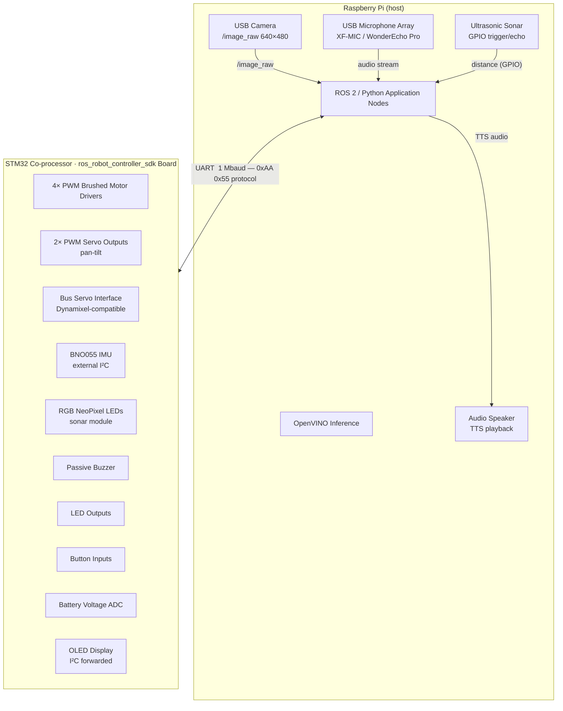
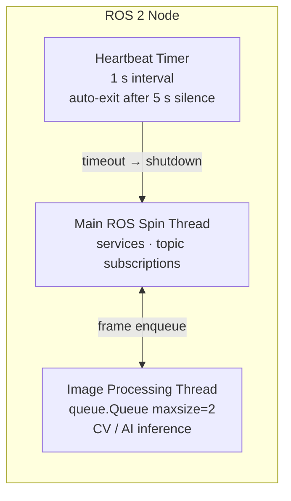
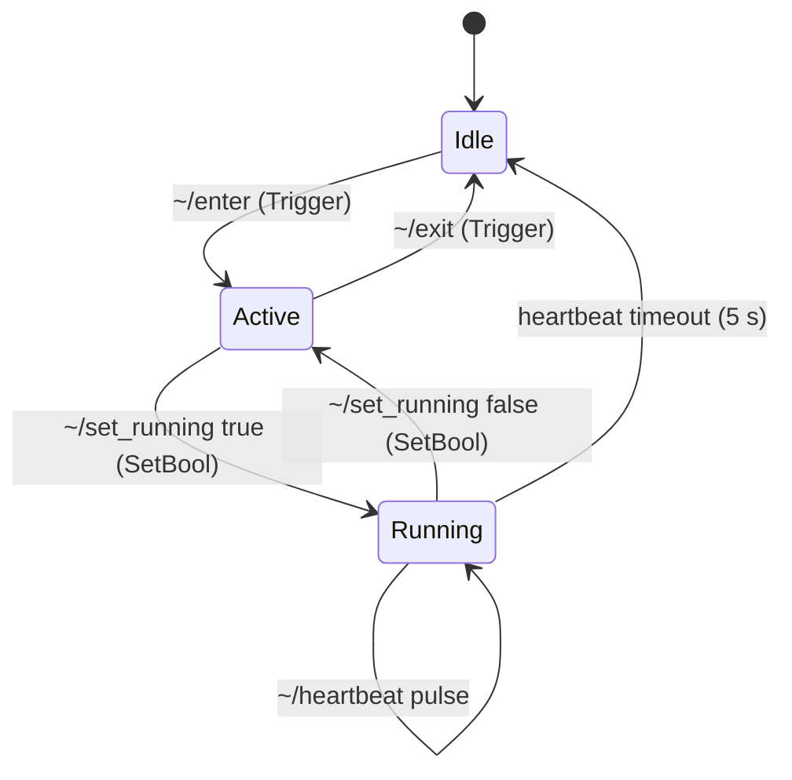
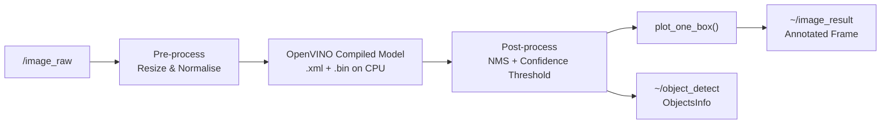
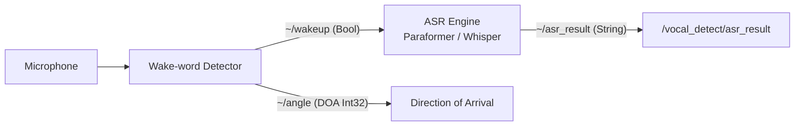
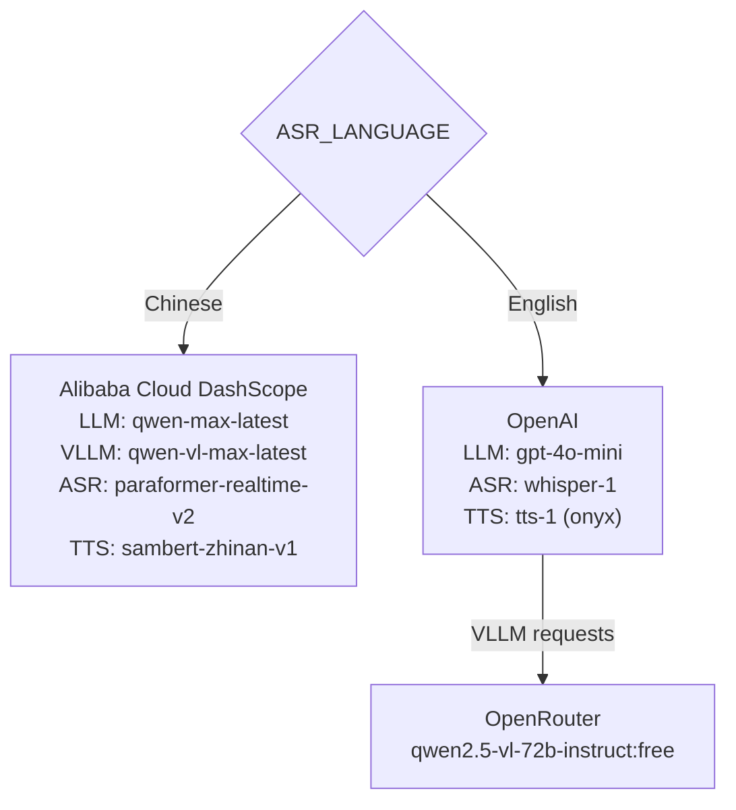
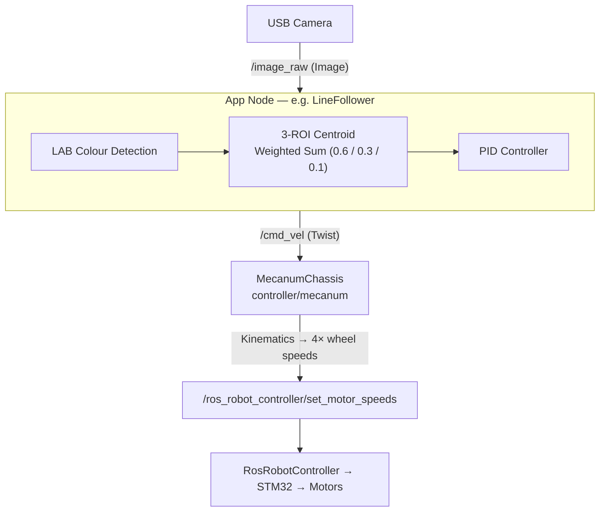
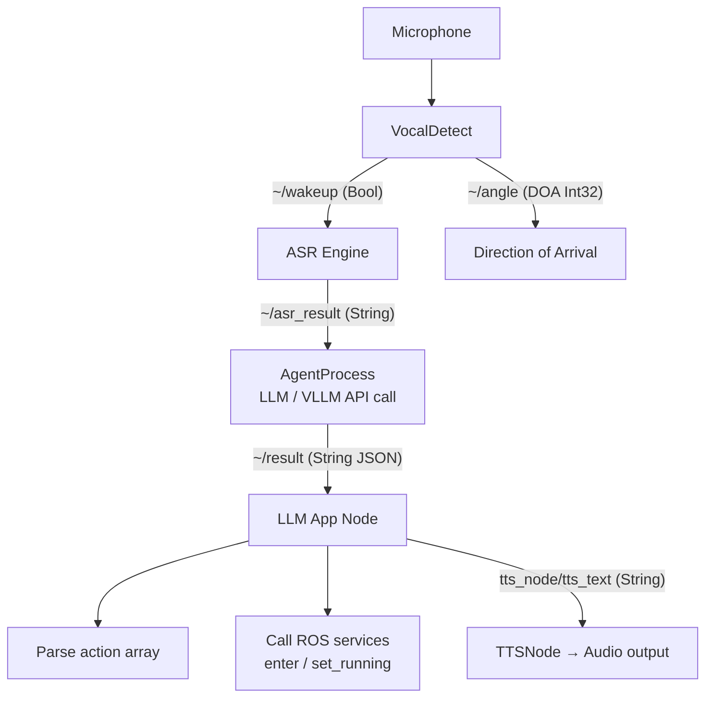
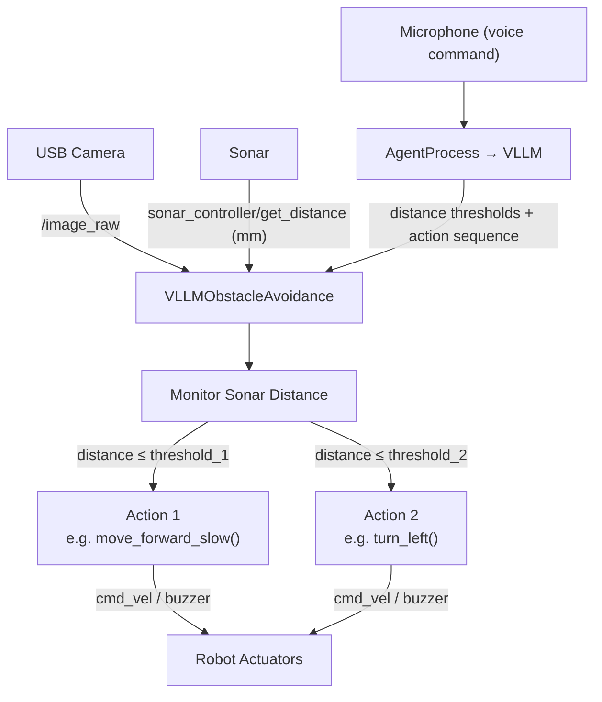

# TurboPi — Full System Documentation

> **Platform:** TurboPi Mecanum-Wheel Robot  
> **Runtime:** ROS 2 (Python)  
> **Target hardware:** Raspberry Pi + STM32 co-processor  
> **Date:** May 2026

---

## Table of Contents

1. [System Overview](#1-system-overview)
2. [Hardware Architecture](#2-hardware-architecture)
3. [Software Architecture](#3-software-architecture)
4. [ROS 2 Package Reference](#4-ros-2-package-reference)
   - 4.1 [driver/ros_robot_controller](#41-driverros_robot_controller)
   - 4.2 [driver/controller](#42-drivercontroller)
   - 4.3 [driver/sdk](#43-driversdk)
   - 4.4 [peripherals](#44-peripherals)
   - 4.5 [imu_pi](#45-imu_pi)
   - 4.6 [app](#46-app)
   - 4.7 [yolov11_detect](#47-yolov11_detect)
   - 4.8 [large_models](#48-large_models)
   - 4.9 [large_models_msgs](#49-large_models_msgs)
   - 4.10 [interfaces](#410-interfaces)
   - 4.11 [dispatcher](#411-dispatcher)
   - 4.12 [bringup](#412-bringup)
   - 4.13 [simulations/turbopi_description](#413-simulationsturbopi_description)
5. [ROS 2 Topic & Service Reference](#5-ros-2-topic--service-reference)
6. [AI & Large-Model Integration](#6-ai--large-model-integration)
7. [Application Modes](#7-application-modes)
8. [Configuration & Environment Variables](#8-configuration--environment-variables)
9. [Launch System](#9-launch-system)
10. [Data Flow Diagrams](#10-data-flow-diagrams)
11. [Developer Quick-Start](#11-developer-quick-start)

---

## 1. System Overview

TwinSight is an AI-driven autonomous mobile robot platform built around a four-wheeled mecanum-drive chassis (TurboPi). It combines classical computer-vision algorithms with state-of-the-art large language models (LLM/VLLM) and real-time speech interaction to produce a versatile research and demonstration platform.

**Key capabilities at a glance:**

| Category | Capabilities |
|---|---|
| Locomotion | Omni-directional mecanum drive, keyboard / joystick / voice / LLM teleoperation |
| Perception | USB RGB camera, BNO055 IMU, ultrasonic sonar |
| Vision CV | Color tracking, line following, QR-code reading, hand gesture & trajectory |
| Vision AI | YOLOv11 (OpenVINO) — traffic signs, garbage classification |
| Speech | Wake-word detection, real-time ASR, TTS (Chinese & English) |
| LLM Brains | Color tracking agent, visual patrol agent, motion control agent, obstacle avoidance agent, smart housekeeper agent |
| Actuators | 4× DC brushed motors, 2× PWM servos (pan-tilt camera), bus servos, buzzer, RGB LEDs, OLED display |

---

## 2. Hardware Architecture



### Mecanum Wheel Physical Parameters

| Parameter | Value |
|---|---|
| Wheelbase (front–rear) | 136.8 mm |
| Track width (left–right) | 141.0 mm |
| Wheel diameter | 65 mm |
| Max linear speed | 1.0 m/s (software cap) |
| Max angular speed | 1.0 rad/s (software cap) |

### Serial Communication Protocol

The STM32 is reached through `/dev/rrc` at **1 000 000 baud**.  
Every packet uses the frame:

```
0xAA  0x55  Length  FunctionCode  ID  [Data …]  CRC8
```

Function codes (defined in `PacketFunction` enum):

| Code | Function |
|---|---|
| 0 | System |
| 1 | LED |
| 2 | Buzzer |
| 3 | Motor speed |
| 4 | PWM servo |
| 5 | Bus servo |
| 6 | Button read |
| 7 | IMU read |
| 8 | Gamepad |
| 9 | SBUS receiver |
| 10 | OLED |
| 11 | RGB LEDs |

---

## 3. Software Architecture

```
┌──────────────────────────────────────────────────────────┐
│                   APPLICATION LAYER                      │
│  app package                large_models package         │
│  ┌──────────────┐           ┌──────────────────────────┐ │
│  │ line_follow  │           │ llm_control_move         │ │
│  │ obj_tracking │           │ llm_color_track          │ │
│  │ avoidance    │           │ llm_visual_patrol        │ │
│  │ gesture_ctrl │           │ vllm_obstacle_avoidance  │ │
│  │ hand_traj    │           │ vllm_smart_housekeeper   │ │
│  │ qrcode       │           │ vllm_with_camera         │ │
│  └──────┬───────┘           └────────────┬─────────────┘ │
│         │                                │               │
├─────────▼────────────────────────────────▼───────────────┤
│                MIDDLEWARE / SERVICES LAYER               │
│  agent_process ─── vocal_detect ─── tts_node             │
│  yolov11_detect ─── dispatcher ─── imu_pi                │
├──────────────────────────────────────────────────────────│
│                  HARDWARE ABSTRACTION LAYER              │
│  ros_robot_controller ─── controller/mecanum             │
│  peripherals (usb_cam, sonar, joystick, teleop)          │
│  sdk (PID, YAML, sonar, fps, common, mecanum helpers)    │
└──────────────────────────────────────────────────────────│
```

### Threading Model

Most nodes use a combination of:
- **Main ROS spin thread** — handles services and topic subscriptions  
- **Image processing thread** — dequeues frames from a `queue.Queue(maxsize=2)` and runs CV/AI inference  
- **Heartbeat timer** — a 1-second ROS timer that checks for client keep-alives; triggers automatic exit after 5 s of silence  



---

## 4. ROS 2 Package Reference

### 4.1 `driver/ros_robot_controller`

**Purpose:** Bridge between ROS 2 and the STM32 firmware.

**Node:** `ros_robot_controller_node` (executable: `ros_robot_controller`)

| Interface | Type | Description |
|---|---|---|
| `~/imu_raw` | `sensor_msgs/Imu` (pub) | Raw IMU data from STM32 |
| `~/joy` | `sensor_msgs/Joy` (pub) | Gamepad state |
| `~/sbus` | `ros_robot_controller_msgs/Sbus` (pub) | RC receiver channels |
| `~/button` | `ros_robot_controller_msgs/ButtonState` (pub) | Physical button events |
| `~/battery` | `std_msgs/UInt16` (pub) | Battery voltage (mV) |
| `~/set_led` | `ros_robot_controller_msgs/LedState` (sub) | LED on/off |
| `~/set_buzzer` | `ros_robot_controller_msgs/BuzzerState` (sub) | Buzzer frequency/duration |
| `~/set_oled` | `ros_robot_controller_msgs/OLEDState` (sub) | OLED text |
| `~/set_motor_speeds` | `ros_robot_controller_msgs/MotorsSpeedControl` (sub) | 4-motor speed (-100…100) |
| `~/bus_servo/set_state` | `ros_robot_controller_msgs/SetBusServoState` (sub) | Bus servo command |
| `~/bus_servo/set_position` | `ros_robot_controller_msgs/ServosPosition` (sub) | Bus servo position |
| `~/pwm_servo/set_state` | `ros_robot_controller_msgs/SetPWMServoState` (sub) | PWM servo pulse width |
| `~/set_rgb` | `ros_robot_controller_msgs/RGBStates` (sub) | RGB LED colours |
| `~/bus_servo/get_state` | `ros_robot_controller_msgs/GetBusServoState` (srv) | Query servo state |
| `~/pwm_servo/get_state` | `ros_robot_controller_msgs/GetPWMServoState` (srv) | Query PWM servo state |
| `~/init_finish` | `std_srvs/Trigger` (srv) | Readiness probe |

On startup the node zeroes all motor speeds and servo offsets, enables serial reception, then enters a spin-and-publish loop on a background thread.

---

### 4.2 `driver/controller`

**Purpose:** Mecanum kinematics — converts `geometry_msgs/Twist` into per-wheel speed commands.

**Node:** `mecanum_chassis`

| Interface | Type | Description |
|---|---|---|
| `/cmd_vel` | `geometry_msgs/Twist` (sub) | Desired body velocity |
| `/ros_robot_controller/set_motor_speeds` | `ros_robot_controller_msgs/MotorsSpeedControl` (pub) | Computed wheel speeds |

**Kinematics:** Standard 4-wheel mecanum forward kinematics:

```
ω₁ = vx − vy − ωz·(L+W)/2
ω₂ = vx + vy − ωz·(L+W)/2
ω₃ = vx + vy + ωz·(L+W)/2
ω₄ = vx − vy + ωz·(L+W)/2
```

Where L = wheelbase (0.1368 m), W = track width (0.1410 m). Speeds are scaled to −100…100 proportionally to `max_linear_speed`.

---

### 4.3 `driver/sdk`

**Purpose:** Reusable Python utility library shared across all application nodes.

| Module | Contents |
|---|---|
| `ros_robot_controller_sdk.py` | Low-level `Board` class — serial packet encode/decode, CRC8, all hardware control methods |
| `mecanum.py` | Standalone mecanum kinematics helper |
| `pid.py` | Discrete PID controller |
| `common.py` | Vector math (`vector_2d_angle`, `distance`), color helpers |
| `yaml_handle.py` | Load/save LAB color calibration YAML (`lab_file_path`) |
| `sonar.py` | GPIO-based ultrasonic distance measurement |
| `fps.py` | Frame-rate counter |
| `led.py` | LED helper |
| `key.py` | Button event helper |

---

### 4.4 `peripherals`

**Purpose:** Sensor and input device drivers.

| Node / Script | Description |
|---|---|
| `usb_cam.launch.py` | Launches `usb_cam` package; publishes `/image_raw` |
| `sonar_controller_node` | Reads Sonar distance → publishes `sonar_controller/get_distance` (Int32, mm). Accepts RGB color commands on `sonar_controller/set_rgb` |
| `teleop_key_control` | Keyboard (WASD) teleoperation; publishes to `cmd_vel` |
| `joystick_control` | Gamepad teleoperation via `~/joy` |
| `imu_filter.launch.py` | Madgwick IMU filter integration |

---

### 4.5 `imu_pi`

**Purpose:** BNO055 9-axis IMU integration over I²C (Raspberry Pi).

**Scripts:**

| Script | Description |
|---|---|
| `read_physical.py` | Console reader — physical units (m/s², rad/s, °) |
| `read_raw.py` | Console reader — raw register values |
| `publish_imu_ros2.py` | Publishes `sensor_msgs/Imu` to `/imu/data` |
| `scan_i2c.py` | Scan I²C bus for connected devices |
| `imu_tracking_common.py` | Shared helpers: `TrackingRuntime`, `TrackingRawSample` dataclasses |

**Configuration:** `config/imu_config.json` — I²C bus number, device address, polling frequency, measurement profile.

**ROS 2 node:** `bno055_publisher` (in `imu_pi` package)  
**Publishes:** `/imu/data` (`sensor_msgs/Imu`)

The `bringup` launch also starts a `temp_odom` node that derives odometry from IMU yaw rate.

---

### 4.6 `app`

**Purpose:** Classical computer-vision application nodes.

All application nodes share a common lifecycle:

1. **`~/enter`** (`std_srvs/Trigger`) — subscribe to camera, reset state  
2. **`~/set_running`** (`std_srvs/SetBool`) — start/pause processing  
3. **`~/exit`** (`std_srvs/Trigger`) — unsubscribe, stop motors  
4. **`~/heartbeat`** (`std_srvs/SetBool`) — keep-alive pulse from web UI; times out after 5 s



#### Line Following (`line_following.py`)

Uses LAB colour space detection across three horizontal ROIs (covering 90 %, 75 %, and 54 % of the image height with weighted contributions 0.6 / 0.3 / 0.1). A PID controller maps centroid deviation to angular velocity.

- Colour target may be set by colour picker (manual) or from LLM output.  
- Publishes: `~/image_result` (Image), `cmd_vel` (Twist)  
- Services: `~/set_color_detect_param`, `~/set_large_model_target_color`

#### Object Tracking (`tracking.py`)

Dual-mode tracker using LAB colour blob detection:
- **Pan-tilt tracking** — two PIDs (X/Y axis, P=0.25 I=0.05 D=0.009) drive servo pulse widths. Servo X: 800–2200 µs, Servo Y: 1200–1900 µs.  
- **Body tracking** — linear / angular velocity derived from pan-tilt PID output.  
- Falls back after 5 s without detecting the target.  

- Publishes: `~/image_result` (Image), `cmd_vel` (Twist), `/ros_robot_controller/pwm_servo/set_state` (PWMServo)  
- Services: `~/set_point` (pick colour at pixel), `~/set_large_model_target_color`, `~/set_running`

#### Obstacle Avoidance (`avoidance_node.py`)

Sonar-based reactive avoidance. Threshold default 30 cm. On detection: stop forward motion, rotate until clear. RGB LEDs on sonar module indicate state.

- Subscribes: `/image_raw`, `sonar_controller/get_distance`  
- Publishes: `~/image_result`, `cmd_vel`, `sonar_controller/set_rgb`  
- Service: `~/set_param` (SetFloat64List — [threshold_cm, speed])

#### Gesture Control (`gesture_control_node.py`)

Uses **MediaPipe Hands** (model_complexity=0) to recognise hand gestures from the camera stream.  
Recognised gestures and mapped robot actions:

| Gesture | Action |
|---|---|
| Fist | Stop |
| One finger | Forward |
| Two fingers (V) | Rotate left |
| Three fingers | Rotate right |
| Four fingers | Backward |
| Five fingers (open) | Stop / neutral |
| Hand heart | Tilt camera down |
| Thumb up | Speed increase |
| OK sign | Lateral movements |

On entry: servo 1 → 1500, servo 2 → 1200. On exit: servos reset to 1500 each.

#### Hand Trajectory (`hand_trajectory_node.py`)

Tracks hand landmark positions with MediaPipe and derives 2D trajectory vectors using `sdk.common.vector_2d_angle`. Publishes detected trajectory waypoints on `interfaces/Points` and current pixel position on `interfaces/PixelPosition`. Can trigger buzzer events via `ros_robot_controller_msgs/BuzzerState`.

#### QR Code Detection (`qrcode.py`)

Uses **pyzbar** to decode QR codes from the camera. The decoded text can trigger pre-defined motion commands. Supports on/off control via `~/start_recognition` service.

---

### 4.7 `yolov11_detect`

**Purpose:** YOLOv11 object detection using **OpenVINO** runtime (CPU-optimised inference on Raspberry Pi).

**Node:** `yolov11_node`  
**Models** (in `models/`):

| File | Description |
|---|---|
| `best_traffic.onnx` / `.xml` / `.bin` | Traffic sign detection |
| `garbage_classification.onnx` / `.xml` / `.bin` | Garbage classification |

**Inference pipeline (`yolov11_detect.py`):**



**Publishes:**
- `~/image_result` (`sensor_msgs/Image`) — annotated frame  
- `~/object_detect` (`interfaces/ObjectsInfo`) — list of detected objects with class, confidence, bounding box

**Subscribes:** `/image_raw`

---

### 4.8 `large_models`

**Purpose:** AI/LLM-powered application nodes that combine speech, vision, and large-model reasoning.

#### `vocal_detect` — Voice Wake-up & ASR

Manages the complete voice pipeline:



| Parameter | Options |
|---|---|
| `awake_method` | `xf` (iFlytek circular mic array) or `wonder` (WonderEcho Pro) |
| `mic_type` | `mic6_circle` or other supported types |
| `awake_word` | Space-separated wake words (default: `hello hi wonder`) |
| `enable_wakeup` | `true` / `false` |
| `mode` | 1 = wake-then-listen, other = continuous |

ASR engines selected by `ASR_LANGUAGE`:
- **Chinese:** Alibaba Cloud Paraformer real-time ASR (`paraformer-realtime-v2`)  
- **English:** OpenAI Whisper (`whisper-1`)

**Topics/Services:**

| Interface | Direction | Description |
|---|---|---|
| `~/asr_result` | pub String | Transcribed text |
| `~/wakeup` | pub Bool | Wake-word triggered |
| `~/angle` | pub Int32 | DOA angle (degrees) of voice source |
| `~/enable_wakeup` | srv SetBool | Enable/disable wake-word |
| `~/set_mode` | srv SetInt32 | Change operating mode |

---

#### `tts_node` — Text-to-Speech

Subscribes to `tts_node/tts_text` (String), synthesises speech, plays audio, then publishes `tts_node/play_finish` (Bool).

Engines:
- **Chinese:** Alibaba Sambert (`sambert-zhinan-v1`)  
- **English:** OpenAI TTS (`tts-1`, voice `onyx`)

---

#### `agent_process` — Central LLM / VLLM Agent

The core reasoning node. Receives ASR text (and optionally a camera image) and calls a configured LLM or VLLM to produce a response.

**Supported model types:**

| `model_type` | Behaviour |
|---|---|
| `llm` | Text-only LLM call |
| `vllm` | Multimodal call — attaches latest camera frame |

**Services:**

| Service | Type | Description |
|---|---|---|
| `~/set_model` | `SetModel` | Change model + type at runtime |
| `~/set_prompt` | `SetString` | Change system prompt |
| `~/set_llm_content` | `SetContent` | Direct LLM query (bypass ASR) |
| `~/set_vllm_content` | `SetContent` | Direct VLLM query with image |
| `~/record_chat` | `SetBool` | Start/stop recording conversation context |
| `~/get_chat` | `Trigger` | Retrieve recorded context |
| `~/clear_chat` | `Empty` | Clear conversation context |

**Topics:**

| Topic | Direction | Description |
|---|---|---|
| `~/result` | pub String | Raw JSON response from LLM/VLLM |
| `vocal_detect/asr_result` | sub String | Input from ASR |
| `<camera_topic>` | sub Image | Camera for VLLM mode |

---

#### `llm_color_track` — LLM-Driven Colour Tracking

Listens for voice commands via wake-word pipeline. The LLM interprets the command (e.g. "Track the green object") and calls `color_track('<color>')` by:
1. Triggering `object_tracking/enter`  
2. Setting `object_tracking/set_large_model_target_color`  
3. Starting `object_tracking/set_running`

System prompt instructs the LLM to output JSON: `{"action": ["color_track('green')"], "response": "Got it!"}`.

---

#### `llm_visual_patrol` — LLM-Driven Line Following

Activates coloured-line following on voice command. System prompt maps commands like "Follow the black line" → `line_following('black')`. Triggers the `app` line-following node services.

---

#### `llm_control_move` — LLM Motion Control

Converts free-form voice commands into robot motion primitives. Publishes directly to `cmd_vel` and `/ros_robot_controller/set_rgb` based on LLM JSON output.

**Action function library (LLM prompt):**

| Function token | Motion |
|---|---|
| `forward` | Forward 1 s |
| `back` | Backward 1 s |
| `turn_left` | Left rotate |
| `turn_right` | Right rotate |
| `drift` | Lateral drift |
| `nod` | Pan-tilt nod |
| `shake_head` | Pan-tilt shake |
| `(R,G,B)` | Set RGB LED colour |

---

#### `vllm_obstacle_avoidance` — Vision-LLM Obstacle Avoidance

Combines sonar distance data with VLLM scene understanding. Voice commands specify distance thresholds (e.g. "Slow down at 30 cm, turn left at 20 cm"). The VLLM parses the command and returns:

```json
{
  "type": "detect",
  "object": "obstacle",
  "action": ["move_forward()", "move_forward_slow()", "turn_left()"],
  "distance_one": [300, 200],
  "response": "Obstacle avoidance engaged"
}
```

The node monitors sonar distance and executes actions at the specified thresholds.

---

#### `vllm_smart_housekeeper` — Vision-LLM Animal Monitor

Continuously sends camera frames to a VLLM with a system prompt instructing it to identify animals and detect when carnivores and herbivores are in the same scene, triggering a buzzer alarm.

---

#### `vllm_with_camera` — General VLLM + Camera

A blank-prompt VLLM node for custom use. Accepts voice queries and responds with the VLLM's interpretation of the current camera frame.

---

### 4.9 `large_models_msgs`

Custom ROS 2 service definitions for the large-models layer:

| Service file | Fields |
|---|---|
| `SetString.srv` | `string data` → `bool success, string message` |
| `SetModel.srv` | `string model, string model_type` → `bool success` |
| `SetContent.srv` | `string content` → `string result` |
| `SetInt32.srv` | `int32 data` → `bool success` |

---

### 4.10 `interfaces`

Custom ROS 2 message and service definitions shared by vision/app nodes.

**Messages:**

| Message | Key fields |
|---|---|
| `ObjectInfo.msg` | `string class_name, float64 score, ROI roi` |
| `ObjectsInfo.msg` | `ObjectInfo[] objects` |
| `ColorInfo.msg` | `string color, ROI roi, Point2D center` |
| `ColorsInfo.msg` | `ColorInfo[] colors` |
| `LineROI.msg` | ROI definition for line following |
| `PixelPosition.msg` | `float32 x, float32 y` |
| `Points.msg` | `Point2D[] points` |
| `Pose2D.msg` | `float64 x, float64 y, float64 theta` |
| `ROI.msg` | `float32 x_min, x_max, y_min, y_max` |
| `Point2D.msg` | `float64 x, float64 y` |

**Services:**

| Service | Purpose |
|---|---|
| `SetColorDetectParam.srv` | Update colour detection LAB range |
| `SetColorRGBA.srv` | Set RGBA colour target |
| `SetCircleROI.srv` / `SetLineROI.srv` | Constrain detection ROI |
| `SetFloat64.srv` / `SetFloat64List.srv` | Generic float parameter |
| `SetInt64.srv` | Generic int parameter |
| `SetPoint.srv` | Set 2D pick point |
| `SetPose.srv` / `SetPose2D.srv` | Set target pose |
| `SetString.srv` / `SetStringList.srv` | Generic string parameter |
| `GetPose.srv` | Query current pose |

---

### 4.11 `dispatcher`

**Purpose:** Multiplexer for line-following commands from multiple sources (classical CV vs. LLM).

**Node:** `line_follow_dispatch`  
Routes incoming line-following trigger messages to the appropriate `app` node service calls, allowing both the classical `line_following` node and the `llm_visual_patrol` node to share the same underlying chassis controller.

---

### 4.12 `bringup`

**Purpose:** System startup orchestration.

**Launch files:**

| File | Description |
|---|---|
| `bringup.launch.py` | Full robot bringup — controller, camera, sonar, web_video_server, rosbridge WebSocket, IMU, odometry, app nodes, startup check |
| `computer_mode.launch.py` | Minimal bringup for computer-side development — controller + camera + keyboard teleop (opens in xterm) |

**Additional nodes launched by `bringup.launch.py`:**

| Node | Package | Description |
|---|---|---|
| `bno055_publisher` | `imu_pi` | IMU data publisher |
| `temp_odom` | `bringup` | Temporary odometry from IMU yaw |
| `startup_check` | `bringup` | Post-boot health check (launched 10 s after startup) |
| `web_video_server` | external | HTTP MJPEG stream for web UI |
| `rosbridge_websocket` | external | WebSocket bridge for web UI |

**System service:** `start_app_node.service` — systemd unit that auto-starts the robot on boot.

---

### 4.13 `simulations/turbopi_description`

**Purpose:** Robot model for simulation and visualisation.

**Files:**

| File | Description |
|---|---|
| `urdf/turbopi.xacro` | Parametric URDF/Xacro robot description |
| `urdf/turbopi_compiled.urdf` | Compiled URDF |
| `urdf/materials.xacro` | Material definitions |
| `rviz/` | Pre-configured RViz layouts |
| `turbopi_unity.zip` | Unity3D robot asset package |

---

## 5. ROS 2 Topic & Service Reference

### Core Topics

| Topic | Type | Publisher | Subscribers |
|---|---|---|---|
| `/image_raw` | `sensor_msgs/Image` | usb_cam | All vision nodes |
| `/cmd_vel` | `geometry_msgs/Twist` | teleop / app / large_models | controller/mecanum |
| `/imu/data` | `sensor_msgs/Imu` | imu_pi | temp_odom, imu_filter |
| `sonar_controller/get_distance` | `std_msgs/Int32` | sonar_controller | avoidance_node, vllm_obstacle_avoidance |
| `sonar_controller/set_rgb` | `ros_robot_controller_msgs/RGBStates` | avoidance_node | sonar_controller |
| `/ros_robot_controller/set_motor_speeds` | `MotorsSpeedControl` | mecanum chassis | ros_robot_controller |
| `/ros_robot_controller/pwm_servo/set_state` | `SetPWMServoState` | tracking / gesture | ros_robot_controller |
| `/ros_robot_controller/set_rgb` | `RGBStates` | app nodes | ros_robot_controller |
| `/ros_robot_controller/set_buzzer` | `BuzzerState` | app nodes | ros_robot_controller |
| `vocal_detect/asr_result` | `std_msgs/String` | vocal_detect | agent_process |
| `vocal_detect/wakeup` | `std_msgs/Bool` | vocal_detect | llm nodes |
| `agent_process/result` | `std_msgs/String` | agent_process | llm nodes |
| `tts_node/tts_text` | `std_msgs/String` | llm nodes | tts_node |
| `tts_node/play_finish` | `std_msgs/Bool` | tts_node | llm nodes |

### Application Lifecycle Services (per app node)

| Service pattern | Type | Description |
|---|---|---|
| `<node>/enter` | `std_srvs/Trigger` | Activate node, subscribe camera |
| `<node>/exit` | `std_srvs/Trigger` | Deactivate node, stop motors |
| `<node>/set_running` | `std_srvs/SetBool` | Pause / resume processing |
| `<node>/heartbeat` | `std_srvs/SetBool` | 5-second keep-alive |
| `<node>/init_finish` | `std_srvs/Trigger` | Readiness probe |

---

## 6. AI & Large-Model Integration

### API Provider Selection

The runtime selects API provider based on the `ASR_LANGUAGE` environment variable:



### Model Configuration (`large_models/config.py`)

| Variable | Chinese default | English default |
|---|---|---|
| LLM model | `qwen-max-latest` | `gpt-4o-mini` |
| VLLM model | `qwen-vl-max-latest` | `qwen/qwen2.5-vl-72b-instruct:free` |
| TTS model | `sambert-zhinan-v1` | `tts-1` |
| ASR model | `paraformer-realtime-v2` | `whisper-1` |
| TTS voice | — | `onyx` |

**Keys to configure** (in `config.py` or environment):
- `aliyun_api_key` — Alibaba Cloud API key (Chinese mode)
- `llm_api_key` — OpenAI API key (English mode)
- `vllm_api_key` — OpenRouter API key (English VLLM mode)

### Audio File Assets

Located in `large_models/resources/audio/` (Chinese) and `large_models/resources/audio/en/` (English):

| File | Trigger |
|---|---|
| `start_audio.wav` | System ready |
| `wakeup.wav` | Wake-word detected |
| `recording.wav` | Recording in progress |
| `tts_audio.wav` | TTS output (generated) |
| `error.wav` | API/processing error |
| `no_voice.wav` | No speech detected |

### JSON Command Protocol

All LLM application nodes instruct the model to respond in a structured JSON format:

```json
{
  "action": ["function_name('arg')", "another_action()"],
  "response": "Short spoken reply (10–30 chars)"
}
```

The `action` array is executed in order. `response` is forwarded to `tts_node` for spoken output.

---

## 7. Application Modes

### Mode 1 — Keyboard Teleoperation

```
ros2 launch bringup computer_mode.launch.py
```
Opens xterm with WASD controls. Useful for basic driving tests.

### Mode 2 — Full Robot Bringup (Web UI)

```
ros2 launch bringup bringup.launch.py
```
Starts all nodes. Web interface accessible via rosbridge WebSocket + web_video_server MJPEG stream.

### Mode 3 — Classical CV Applications

Launch any of the following (after full bringup):

```bash
ros2 launch app line_following.launch.py
ros2 launch app object_tracking.launch.py
ros2 launch app avoidance_node.launch.py
ros2 launch app gesture_control_node.launch.py
ros2 launch app qrcode.launch.py
```

Then call `/<node>/enter` → `/<node>/set_running true` to activate.

### Mode 4 — AI/LLM Applications

Start speech infrastructure first:

```bash
ros2 launch large_models start.launch.py   # vocal_detect + tts_node + agent_process
```

Then launch the desired LLM app:

```bash
ros2 launch large_models llm_control_move.launch.py          # Voice motion control
ros2 launch large_models llm_color_track.launch.py           # Voice color tracking
ros2 launch large_models llm_visual_patrol.launch.py         # Voice line following
ros2 launch large_models vllm_obstacle_avoidance.launch.py   # Vision obstacle avoidance
ros2 launch large_models vllm_smart_housekeeper.launch.py    # Animal monitor
ros2 launch large_models vllm_with_camera.launch.py          # Generic VLLM queries
```

### Mode 5 — YOLOv11 Object Detection

```bash
ros2 launch yolov11_detect <launch_file>.launch.py
```

Available models: traffic sign detection, garbage classification.

---

## 8. Configuration & Environment Variables

### Required Environment Variables

| Variable | Values | Description |
|---|---|---|
| `ASR_LANGUAGE` | `Chinese` or `English` | Selects API provider and language for all speech nodes |
| `MACHINE_TYPE` | `MentorPi_Acker` or unset | Changes teleop speed scaling |

### API Keys (in `large_models/config.py`)

Set the appropriate key(s) before running AI modes:

```python
# Chinese mode
aliyun_api_key = 'YOUR_DASHSCOPE_KEY'

# English mode — LLM
llm_api_key = 'YOUR_OPENAI_KEY'

# English mode — VLLM (OpenRouter)
vllm_api_key = 'YOUR_OPENROUTER_KEY'
```

### Colour Calibration

LAB colour ranges are stored in a YAML file referenced by `sdk.yaml_handle.lab_file_path`. Run the colour picker in the object tracking or line following UI to update ranges interactively.

### IMU Configuration (`imu_pi/config/imu_config.json`)

```json
{
  "i2c_bus": 1,
  "device_address": "0x28",
  "profile": "NDOF",
  "frequency_hz": 100
}
```

---

## 9. Launch System

### Dependency Graph

```
bringup.launch.py
├── controller.launch.py         (mecanum chassis)
│   └── ros_robot_controller     (STM32 bridge)
├── usb_cam.launch.py            (camera)
├── sonar_controller_node.launch.py
├── start_app.launch.py
│   ├── gesture_control_node.launch.py
│   ├── line_following_node.launch.py
│   ├── object_tracking_node.launch.py
│   └── avoidance_node.launch.py
├── bno055_publisher             (IMU)
├── temp_odom                    (odometry)
├── web_video_server             (HTTP MJPEG)
├── rosbridge_websocket          (WebSocket bridge)
└── startup_check  [+10 s delay]
```

### Auto-start (systemd)

The file `bringup/scripts/start_app_node.service` registers the full bringup as a systemd service. To manage:

```bash
sudo systemctl start  start_app_node.service
sudo systemctl stop   start_app_node.service
sudo systemctl enable start_app_node.service   # enable on boot
```

---

## 10. Data Flow Diagrams

### Classical Vision Pipeline



### LLM Voice Control Pipeline



### VLLM Obstacle Avoidance Pipeline



---

## 11. Developer Quick-Start

### Prerequisites

```bash
# ROS 2 workspace
cd ~/ros2_ws
colcon build --symlink-install
source install/setup.bash

# Python speech package
cd ~/large_models/speech_pkg
pip install -e .
```

### Running a Minimal Test (no AI)

```bash
export ASR_LANGUAGE=English
ros2 launch bringup computer_mode.launch.py
```

This brings up the chassis driver and camera. Drive with WASD in the xterm window.

### Adding Colour Tracking

With the robot running:

```bash
# In a new terminal
source ~/ros2_ws/install/setup.bash
ros2 launch app object_tracking.launch.py
```

Then via CLI or web UI:
```bash
ros2 service call /object_tracking/enter std_srvs/srv/Trigger '{}'
ros2 service call /object_tracking/set_running std_srvs/srv/SetBool '{data: true}'
```

### Enabling Voice Control (English)

1. Edit `~/ros2_ws/src/large_models/large_models/config.py` and set `llm_api_key`.
2. Export environment:
   ```bash
   export ASR_LANGUAGE=English
   ```
3. Launch:
   ```bash
   ros2 launch large_models start.launch.py
   ros2 launch large_models llm_control_move.launch.py
   ```
4. Say the wake word ("hello"), then speak a command such as "move forward then turn left".

### Calibrating Colours

1. Start the full bringup.
2. Open the web UI or run `ros2 launch app object_tracking.launch.py`.
3. Call `~/set_point` with the pixel coordinates of the target colour.
4. The `ColorPicker` class will sample the LAB values over `repeat` frames and return the averaged LAB + RGB tuple.
5. Save to YAML via `sdk.yaml_handle`.

### Building the Workspace

```bash
cd ~/ros2_ws
colcon build --packages-select <package_name>
# or build everything:
colcon build
```

### Key File Locations

| Purpose | Path |
|---|---|
| Main bringup launch | `ros2_ws/src/bringup/launch/bringup.launch.py` |
| AI config & API keys | `ros2_ws/src/large_models/large_models/config.py` |
| Colour calibration YAML | Path from `sdk.yaml_handle.lab_file_path` |
| IMU config | `imu_pi/config/imu_config.json` |
| YOLOv11 models | `ros2_ws/src/yolov11_detect/models/` |
| Robot URDF | `ros2_ws/src/simulations/turbopi_description/urdf/turbopi.xacro` |
| STM32 SDK | `ros2_ws/src/driver/sdk/sdk/ros_robot_controller_sdk.py` |
| Systemd service | `ros2_ws/src/bringup/scripts/start_app_node.service` |

---

*Documentation generated from source — May 2026.*
