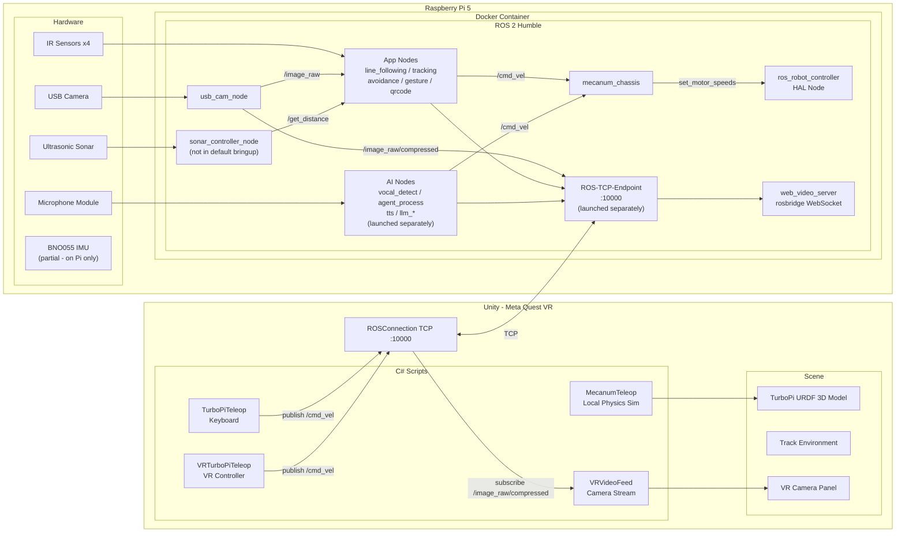
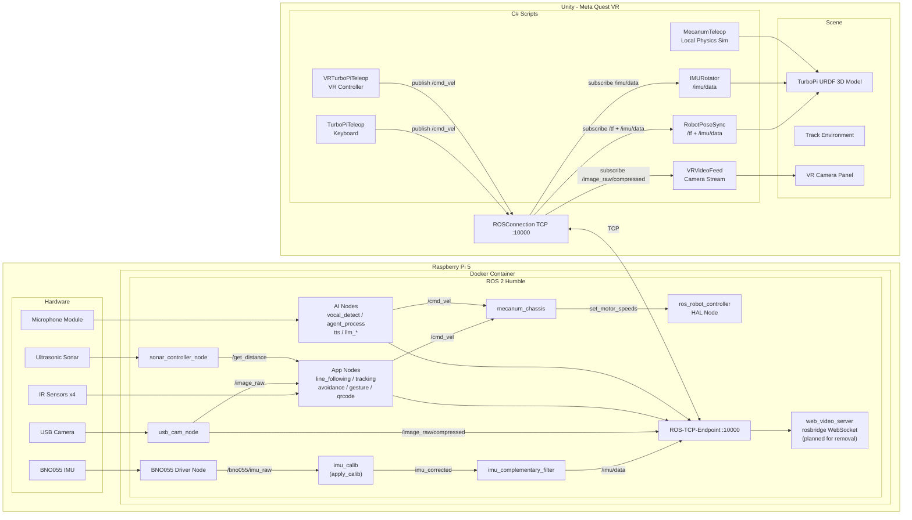

# TwinSight System Architecture

## Current Implementation

```mermaid
flowchart LR
    subgraph PI["Raspberry Pi 5"]
        subgraph HW["Hardware"]
            CAM["USB Camera"]
            SONAR["Ultrasonic Sonar"]
            IR["IR Sensors x4"]
            MIC["Microphone Module"]
            BNO["BNO055 IMU\n(partial - on Pi only)"]
        end

        subgraph DOCKER["Docker Container\nosrf/ros:humble-desktop-full"]
            subgraph ROS2["ROS 2 Humble"]
                HAL["ros_robot_controller\nHAL Node"]
                CTRL["mecanum_chassis"]
                CAM_N["usb_cam_node"]
                SON_N["sonar_controller_node\n(not in default bringup)"]
                APPS["App Nodes\nline_following / tracking\navoidance / gesture / qrcode"]
                AI_N["AI Nodes\nvocal_detect / agent_process\ntts / llm_*\n(launched separately)"]
                TCP_EP["ROS-TCP-Endpoint\n:10000\n(launched separately)"]
                MISC["web_video_server\nrosbridge WebSocket"]
            end
        end

        CAM --> CAM_N
        SONAR --> SON_N
        IR --> APPS
        MIC --> AI_N
        CAM_N -->|"/image_raw"| APPS
        CAM_N -->|"/image_raw/compressed"| TCP_EP
        SON_N -->|"/get_distance"| APPS
        APPS -->|"/cmd_vel"| CTRL
        AI_N -->|"/cmd_vel"| CTRL
        CTRL -->|"set_motor_speeds"| HAL
        APPS --> TCP_EP
        AI_N --> TCP_EP
        TCP_EP --> MISC
    end

    subgraph UNITY["Unity - Meta Quest VR"]
        subgraph SCENE["Scene"]
            MDL["TurboPi URDF 3D Model"]
            TRK["Track Environment"]
            VID_SCR["VR Camera Panel"]
        end
        subgraph CS["C# Scripts"]
            KB["TurboPiTeleop\nKeyboard"]
            VRC["VRTurboPiTeleop\nVR Controller"]
            VF["VRVideoFeed\nCamera Stream"]
            MT["MecanumTeleop\nLocal Physics Sim"]
        end
        ROSCON["ROSConnection TCP :10000"]

        KB -->|"publish /cmd_vel"| ROSCON
        VRC -->|"publish /cmd_vel"| ROSCON
        ROSCON -->|"subscribe /image_raw/compressed"| VF
        MT --> MDL
        VF --> VID_SCR
    end

    ROSCON <-->|"TCP"| TCP_EP
```

---

## Full Vision

```mermaid
flowchart LR
    subgraph PI["Raspberry Pi 5"]
        subgraph HW["Hardware"]
            CAM["USB Camera"]
            SONAR["Ultrasonic Sonar"]
            IR["IR Sensors x4"]
            MIC["Microphone Module"]
            BNO["BNO055 IMU"]
        end

        subgraph DOCKER["Docker Container\nosrf/ros:humble-desktop-full"]
            subgraph ROS2["ROS 2 Humble"]
                HAL["ros_robot_controller\nHAL Node"]
                CTRL["mecanum_chassis"]
                CAM_N["usb_cam_node"]
                SON_N["sonar_controller_node"]
                APPS["App Nodes\nline_following / tracking\navoidance / gesture / qrcode"]
                AI_N["AI Nodes\nvocal_detect / agent_process\ntts / llm_*"]
                BNO_N["BNO055 Driver Node"]
                IMU_CAL["imu_calib\n(apply_calib)"]
                IMU_FLT["imu_complementary_filter"]
                TCP_EP["ROS-TCP-Endpoint :10000"]
                MISC["web_video_server\nrosbridge WebSocket\n(planned for removal)"]
            end
        end

        CAM --> CAM_N
        SONAR --> SON_N
        IR --> APPS
        MIC --> AI_N
        BNO --> BNO_N

        BNO_N -->|"/bno055/imu_raw"| IMU_CAL
        IMU_CAL -->|"imu_corrected"| IMU_FLT
        IMU_FLT -->|"/imu/data"| TCP_EP

        CAM_N -->|"/image_raw"| APPS
        CAM_N -->|"/image_raw/compressed"| TCP_EP
        SON_N -->|"/get_distance"| APPS
        APPS -->|"/cmd_vel"| CTRL
        AI_N -->|"/cmd_vel"| CTRL
        CTRL -->|"set_motor_speeds"| HAL
        APPS --> TCP_EP
        AI_N --> TCP_EP
        TCP_EP --> MISC
    end

    subgraph UNITY["Unity - Meta Quest VR"]
        subgraph SCENE["Scene"]
            MDL["TurboPi URDF 3D Model"]
            TRK["Track Environment"]
            VID_SCR["VR Camera Panel"]
        end
        subgraph CS["C# Scripts"]
            KB["TurboPiTeleop\nKeyboard"]
            VRC["VRTurboPiTeleop\nVR Controller"]
            VF["VRVideoFeed\nCamera Stream"]
            PS["RobotPoseSync\n/tf + /imu/data"]
            IR2["IMURotator\n/imu/data"]
            MT["MecanumTeleop\nLocal Physics Sim"]
        end
        ROSCON["ROSConnection TCP :10000"]

        KB -->|"publish /cmd_vel"| ROSCON
        VRC -->|"publish /cmd_vel"| ROSCON
        ROSCON -->|"subscribe /image_raw/compressed"| VF
        ROSCON -->|"subscribe /imu/data"| IR2
        ROSCON -->|"subscribe /tf + /imu/data"| PS
        PS --> MDL
        IR2 --> MDL
        MT --> MDL
        VF --> VID_SCR
    end

    ROSCON <-->|"TCP"| TCP_EP
```
