# TwinSight — Digital Twin Project Documentation

> **Platform:** TurboPi Mecanum-Wheel Robot + Unity VR  
> **Bridge:** ROS-TCP-Endpoint (TCP port 10000)  
> **Unity version:** Unity 6 (URP)  
> **ROS runtime:** ROS 2 Humble (runs natively on Raspberry Pi 5 — Docker not currently in use)  
> **Headset:** Meta Quest 3  
> **Author:** TwinSight / LURA Research Group  
> **Date:** May 2026

---

## Table of Contents

0. [About This Project](#0-about-this-project)
1. [Hardware Specifications](#1-hardware-specifications)
2. [Software Platforms Used](#2-software-platforms-used)
3. [What Is a Digital Twin?](#3-what-is-a-digital-twin)
4. [System Overview](#4-system-overview)
5. [ROS 2 — Full Guide](#5-ros-2--full-guide)
   - 5.1 [What Is ROS 2?](#51-what-is-ros-2)
   - 5.2 [ROS 2 Packages in This Project](#52-ros-2-packages-in-this-project)
   - 5.3 [Setting Up the ROS 2 Workspace](#53-setting-up-the-ros-2-workspace)
   - 5.4 [Launch Configurations](#54-launch-configurations)
   - 5.5 [Where to Learn ROS 2](#55-where-to-learn-ros-2)
6. [Unity — Full Guide](#6-unity--full-guide)
   - 6.1 [Unity Packages Used](#61-unity-packages-used)
   - 6.2 [Scripts Written for This Project](#62-scripts-written-for-this-project)
   - 6.3 [What You Need to Know Software-Wise](#63-what-you-need-to-know-software-wise)
7. [Communication Bridge: ROS ↔ Unity](#7-communication-bridge-ros--unity)
8. [Installation Instructions](#8-installation-instructions)
   - 8.1 [Prerequisites](#81-prerequisites)
   - 8.2 [Docker Setup (Future Use)](#82-docker-setup-future-use)
   - 8.3 [ROS 2 Workspace Setup](#83-ros-2-workspace-setup)
   - 8.4 [Unity Project Setup](#84-unity-project-setup)
   - 8.5 [Meta Quest 3 Setup](#85-meta-quest-3-setup)
9. [Maps and Environment](#9-maps-and-environment)
10. [Implemented Features (What Works Now)](#10-implemented-features-what-works-now)
    - 10.1 [VR Teleoperation](#101-vr-teleoperation)
    - 10.2 [Live Camera Feed in VR](#102-live-camera-feed-in-vr)
    - 10.3 [Robot Orientation Sync (Partial)](#103-robot-orientation-sync-partial)
    - 10.4 [Local Physics Simulation](#104-local-physics-simulation)
    - 10.5 [Keyboard / Gamepad Teleoperation](#105-keyboard--gamepad-teleoperation)
11. [Current Challenges and Limitations](#11-current-challenges-and-limitations)
12. [Architecture of the Full Vision](#12-architecture-of-the-full-vision)
13. [Future Implementations and Future Robots](#13-future-implementations-and-future-robots)
14. [Achievements](#14-achievements)
15. [Data Flow Reference](#15-data-flow-reference)
16. [Developer Notes](#16-developer-notes)

---

## 0. About This Project

**TwinSight** is a research project developed as part of the LURA (Learning Undergraduate Research Award) programme. The goal is to build a fully functional **real-time digital twin** of a physical mobile robot that can be experienced and controlled through a **VR headset**.

### What We Are Building

A "digital twin" means there is a 3D virtual robot inside a VR environment that mirrors everything the real robot does — it rotates when the robot rotates, its camera feed appears on a virtual screen, and a user wearing a VR headset can drive the real robot with a thumbstick. As the project grows, the twin will reflect sensor readings, AI decisions, and the robot's map of its environment.

### Everything Being Used

| Category | Specific Technology |
|---|---|
| **Physical robot** | HiWonder TurboPi (mecanum-wheel, Raspberry Pi 5 + STM32) |
| **Robot OS** | ROS 2 Humble Hawksbill |
| **Robot runtime environment** | ROS 2 Humble running natively on the Raspberry Pi 5 (Docker not currently in use — see [Section 8.2](#82-docker-setup-future-use)) |
| **Host machine (development)** | Windows 11 PC |
| **3D engine / VR platform** | Unity 6 (Universal Render Pipeline) |
| **VR headset** | Meta Quest 3 |
| **Unity–ROS bridge** | Unity Robotics Hub — ROS-TCP-Connector + ROS-TCP-Endpoint |
| **IMU** | Bosch BNO055 9-axis (I²C, on Raspberry Pi) |
| **Camera** | USB RGB camera (640×480, published via `usb_cam` package) |
| **Sonar** | GPIO-based ultrasonic distance sensor |
| **Motor controller** | STM32 co-processor (UART 1 Mbaud, 0xAA 0x55 protocol) |
| **Robot description format** | URDF / Xacro |
| **Vision AI** | YOLOv11 (OpenVINO, CPU inference) |
| **LLM integration** | OpenAI GPT-4o-mini / Alibaba Qwen (selectable via env var) |
| **Version control** | Git / GitHub |

---

## 1. Hardware Specifications

### TurboPi Robot Platform

| Component | Specification |
|---|---|
| **Chassis** | Mecanum-wheel omni-directional |
| **Compute** | Raspberry Pi 5 (4 GB RAM) |
| **Co-processor** | STM32 (motor control, sensors, servos) |
| **Motors** | 4× DC brushed, PWM-controlled (speed range −100…100) |
| **Wheelbase (front–rear)** | 136.8 mm |
| **Track width (left–right)** | 141.0 mm |
| **Wheel diameter** | 65 mm |
| **Max linear speed** | 1.0 m/s (software cap) |
| **Max angular speed** | 1.0 rad/s (software cap) |
| **Servos** | 2× PWM servos for pan-tilt camera mount |
| **Bus servos** | Dynamixel-compatible bus servo interface |
| **IMU** | Bosch BNO055 (I²C address `0x28`, bus 1) |
| **Camera** | USB RGB camera — 640×480, up to 30 fps |
| **Sonar** | HC-SR04 compatible, GPIO trigger/echo |
| **Battery** | 2S LiPo (~8.4 V fully charged, ~7.2 V low) |
| **LEDs** | RGB NeoPixel array (on sonar module) |
| **Display** | OLED (I²C forwarded through STM32) |
| **Buzzer** | Passive buzzer (PWM-controlled) |
| **Communication** | UART serial `/dev/rrc` at 1,000,000 baud |

### Serial Packet Protocol (STM32 ↔ Raspberry Pi)

Every command/response uses the frame format:

```
0xAA  0x55  Length  FunctionCode  ID  [Data…]  CRC8
```

| Function Code | Purpose |
|---|---|
| 0 | System |
| 1 | LED |
| 2 | Buzzer |
| 3 | Motor speed |
| 4 | PWM servo |
| 5 | Bus servo |
| 6 | Button read |
| 7 | IMU read |
| 8 | Gamepad |
| 9 | SBUS receiver |
| 10 | OLED display |
| 11 | RGB LEDs |

### Development Machine

| Item | Spec |
|---|---|
| **OS** | Windows 11 |
| **RAM** | Needs at least 8 GB |
| **GPU** | Highly recommend at least a 1660 RTX GPU|
| **VR headset** | Meta Quest 3 |
| **Network** | Both PC and robot on same LAN (Wi-Fi or wired) |

> **TO DO LATER** — Add photos of the physical hardware setup, robot assembly, and cable routing.
>
> To add photos: save images to `documentation/images/` and embed them like this:
> ```markdown
> 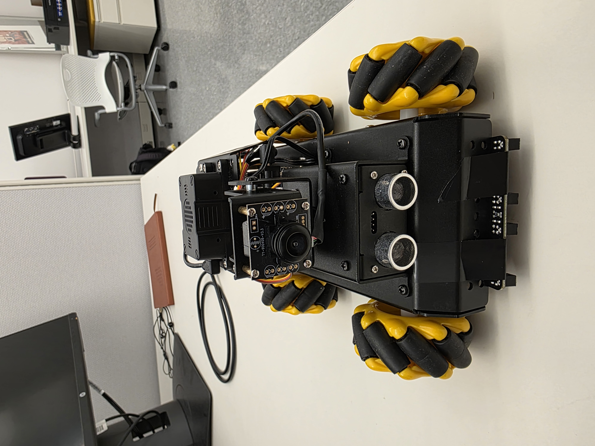
> 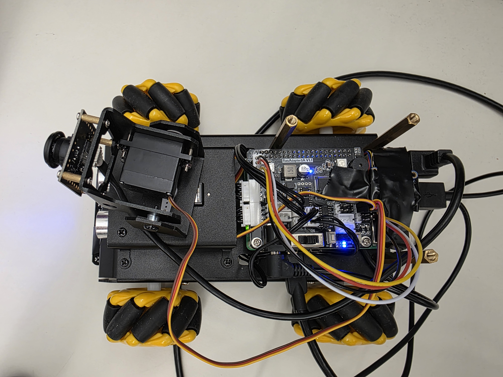
> 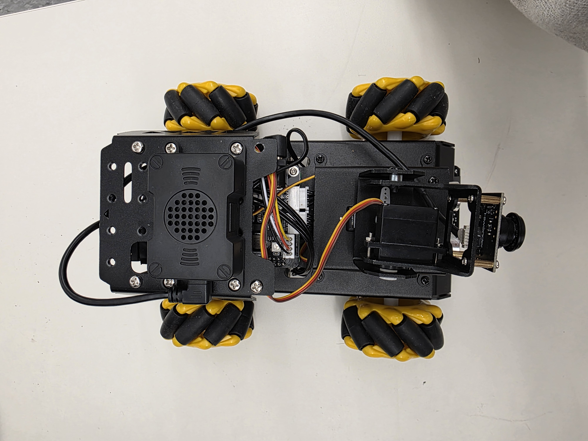
> ```

---

## 2. Software Platforms Used

If you have never used any of these tools before, start with the learning resources in [Section 5.5](#55-where-to-learn-ros-2) and [Section 6.3](#63-what-you-need-to-know-software-wise).

| Tool | Version | What It Does in This Project |
|---|---|---|
| **ROS 2 Humble** | Humble Hawksbill (LTS) | Runs all robot software nodes — camera, motors, IMU, AI |
| **Docker Desktop** | Latest | Not currently installed — planned for future use (path planning, offloading compute). See [Section 8.2](#82-docker-setup-future-use) |
| **Unity** | Unity 6 (6000.x) | 3D engine hosting the digital twin and VR experience |
| **Unity XR Interaction Toolkit** | 3.x | VR input handling, controller tracking on Meta Quest |
| **Unity ROS-TCP-Connector** | 0.7.x | C# package allowing Unity to subscribe/publish ROS topics |
| **ROS-TCP-Endpoint** | Humble-compatible | ROS 2 package acting as the TCP server on the robot side |
| **Unity URDF Importer** | 0.5.x | Imports the robot's URDF model into Unity as a 3D object |
| **Meta Quest Link / Air Link** | Latest | Wireless PC VR streaming for development in the Editor |
| **Meta Quest Developer Hub** | Latest | Sideloading the Unity build onto the Quest 3 |
| **Python 3.10** | System (native on Pi) | All ROS 2 nodes are written in Python |
| **OpenVINO** | Latest (Raspberry Pi) | Hardware-accelerated YOLOv11 inference on the Pi |
| **Git** | 2.x | Version control |
| **VS Code** | Latest | Code editor (Windows-side; SSH into Pi for robot-side edits) |

---

## 3. What Is a Digital Twin?

A **digital twin** is a live, synchronized virtual replica of a physical system. For TwinSight this means:

- The Unity 3D model of the TurboPi reflects the **real robot's state in real time** (pose, joint angles, sensor readings).
- A user wearing a **Meta Quest VR headset** can observe the physical robot through its virtual replica and send commands back to it.
- The twin also enables **predictive simulation** — you can run actions in Unity first, compare with the real robot's response, and tune behaviour without hardware risk.

The target fidelity levels are:

| Level | What is mirrored |
|---|---|
| **Pose** | Position and orientation in the world |
| **Kinematics** | Wheel rotation, pan-tilt servo angles |
| **Sensor** | Camera feed, sonar distance, IMU data |
| **State** | Current app mode, AI agent status, battery |
| **Environment** | Track map, obstacles detected by sensors |

The current implementation covers part of **Pose** (orientation only) and **Sensor** (camera + partial IMU).

---

## 4. System Overview

```
┌─────────────────────────────────────────────────────────────────────┐
│                    PHYSICAL ROBOT (TurboPi)                         │
│                                                                     │
│  Raspberry Pi 5                                                     │
│  └── ROS 2 Humble (native — Docker not currently in use)            │
│       ├── ros_robot_controller  ←→  STM32 (UART 1 Mbaud)           │
│       ├── mecanum_chassis  (/cmd_vel → motor speeds)                │
│       ├── usb_cam_node  (/image_raw, /image_raw/compressed)         │
│       ├── bno055_publisher  (/imu/data)                             │
│       ├── temp_odom  (/odom  ← cmd_vel + IMU yaw)                  │
│       └── ROS-TCP-Endpoint  :10000                                  │
└────────────────────────────────┬────────────────────────────────────┘
                                 │  TCP port 10000
                 ┌───────────────▼───────────────┐
                 │        ROS-TCP-Endpoint        │
                 │  bidirectional message bridge  │
                 └───────────────┬───────────────┘
                                 │
┌────────────────────────────────▼────────────────────────────────────┐
│              UNITY (Meta Quest VR / PC Editor)                      │
│                                                                     │
│  ROSConnection singleton  (TCP → ROS-TCP-Endpoint)                  │
│  ├── VRTurboPiTeleop.cs   → publish /cmd_vel                        │
│  ├── TurboPiTeleop.cs     → publish /cmd_vel (KB/gamepad)           │
│  ├── TwinOrientation.cs   → subscribe /odom  → model rotation       │
│  ├── VRVideoFeed.cs       → subscribe /image_raw/compressed         │
│  ├── MecanumTeleop.cs     → local Unity physics (no ROS)            │
│  └── TwinSightTeleop.cs   → subscribe /cmd_vel → cube (test)        │
└─────────────────────────────────────────────────────────────────────┘
```

---

## 5. ROS 2 — Full Guide

### 5.1 What Is ROS 2?

**ROS 2 (Robot Operating System 2)** is not really an operating system — it is a **middleware framework** for writing robot software. Think of it as a structured way for many small programs (called **nodes**) to talk to each other over a network using a **publish/subscribe** or **request/response** pattern.

**Key concepts you need to understand:**

| Concept | Plain English Explanation |
|---|---|
| **Node** | A single program (Python script or C++ binary) that does one job — e.g. "read the camera", "control the motors", "detect objects" |
| **Topic** | A named data channel. Nodes publish data onto a topic; other nodes subscribe to receive it. Like a group chat with a specific name |
| **Message** | The data type sent over a topic. E.g. `geometry_msgs/Twist` is a message that holds a velocity (linear + angular) |
| **Service** | A request–response mechanism (like a function call). One node calls a service, another handles it and replies |
| **Package** | A folder containing related nodes, launch files, and config — like a Python package but for ROS |
| **Launch file** | A Python or XML file that starts several nodes at once with specific parameters |
| **Topic name** | Looks like a file path: `/cmd_vel`, `/image_raw`, `/imu/data`. The leading `/` means it is a global topic |
| `colcon build` | The tool that compiles and installs all ROS 2 packages in the workspace |
| `ros2 run` | Runs a single node from a package |
| `ros2 launch` | Runs a launch file (which starts multiple nodes) |
| `ros2 topic list` | Shows all active topics |
| `ros2 topic echo /topic_name` | Prints live data coming through a topic |

**The key mental model:** everything in this robot is just nodes sending messages to each other. The camera node publishes images. The controller node reads velocities. The motor node makes the wheels spin. Unity is another “node” that joins the same network over TCP.

---

### 5.2 ROS 2 Packages in This Project

All packages live inside `turbopi_ros2/ros2_ws/src/`.

| Package | What It Does |
|---|---|
| `driver/ros_robot_controller` | **The most critical package.** Talks to the STM32 over serial. Publishes battery, IMU, buttons. Subscribes to motor/servo commands |
| `driver/controller` | Converts `/cmd_vel` (velocity intent) into per-wheel motor speed numbers using mecanum kinematics |
| `driver/sdk` | Python utility library — serial protocol, PID controller, YAML colour config, sonar GPIO, FPS counter |
| `peripherals` | Camera launch, sonar node, keyboard teleop, joystick control |
| `imu_pi` | Reads the BNO055 IMU over I²C and publishes `sensor_msgs/Imu` to `/imu/data` |
| `app` | Classical CV applications: line following, object tracking, obstacle avoidance, gesture control, QR codes |
| `yolov11_detect` | YOLOv11 object detection with OpenVINO — traffic signs and garbage classification |
| `large_models` | AI/LLM voice pipeline — wake word, ASR, TTS, GPT-4o/Qwen agents |
| `large_models_msgs` | Custom ROS 2 service message definitions for the LLM layer |
| `interfaces` | Custom message and service definitions for vision nodes |
| `dispatcher` | Multiplexes line-following commands from CV vs. LLM sources |
| `bringup` | System orchestration — launch files that start everything, plus `temp_odom` (dead-reckoning odometry) |
| `simulations/turbopi_description` | URDF/Xacro robot model for RViz and Unity |
| `ROS-TCP-Endpoint` | The TCP bridge between ROS 2 and Unity |

---

### 5.3 Setting Up the ROS 2 Workspace

> Full step-by-step installation is in [Section 8](#8-installation-instructions). This section explains the workspace structure.

```
turbopi_ros2/
└── ros2_ws/                   ← ROS 2 workspace root
    ├── src/                   ← Your packages go here (edit these)
    │   ├── bringup/
    │   ├── driver/
    │   ├── app/
    │   └── ...
    ├── build/                 ← Auto-generated by colcon (do not edit)
    ├── install/               ← Auto-generated — your built packages land here
    └── log/                   ← Build/run logs
```

**Workflow every time you change code:**

```bash
cd ~/ros2_ws
colcon build --symlink-install   # rebuild changed packages
source install/setup.bash        # reload the environment
ros2 launch bringup bringup.launch.py  # start the robot
```

`--symlink-install` creates symlinks instead of copies for Python files, so you can edit `.py` files without rebuilding every time.

**Checking what is running:**

```bash
ros2 node list          # see all active nodes
ros2 topic list         # see all active topics
ros2 topic echo /odom   # print live odometry messages
ros2 topic hz /imu/data # check how fast the IMU is publishing
```

---

### 5.4 Launch Configurations

Launch files are Python scripts that start multiple ROS nodes with configuration. They live in each package's `launch/` folder.

#### Main Launch Files

| File | Command | What It Starts |
|---|---|---|
| `bringup/launch/bringup.launch.py` | `ros2 launch bringup bringup.launch.py` | Full robot — controller, camera, IMU, odometry, startup check |
| `bringup/launch/computer_mode.launch.py` | `ros2 launch bringup computer_mode.launch.py` | Minimal — controller + camera + keyboard teleop in xterm |
| `ros_tcp_endpoint/launch/endpoint.py` | `ros2 launch ros_tcp_endpoint endpoint.py` | TCP bridge for Unity (port 10000) |
| `app/launch/line_following.launch.py` | `ros2 launch app line_following.launch.py` | Classical line-following CV node |
| `app/launch/object_tracking.launch.py` | `ros2 launch app object_tracking.launch.py` | Colour-blob tracking node |
| `large_models/launch/start.launch.py` | `ros2 launch large_models start.launch.py` | Voice pipeline (wake word + ASR + TTS) |
| `large_models/launch/llm_control_move.launch.py` | `ros2 launch large_models llm_control_move.launch.py` | Voice → LLM → robot motion |

#### Important Note on bringup.launch.py

Several things are **commented out** in the current bringup — meaning they do not start automatically:

```python
# web_video_server_launch,      # HTTP MJPEG stream (not needed for Unity)
# rosbridge_websocket_launch,   # WebSocket bridge (legacy, not needed for Unity)
# sonar_controller_launch,      # Sonar (uncomment to enable obstacle detection)
# start_app_launch,             # CV app nodes (uncomment to run line follow etc.)
```

The **ROS-TCP-Endpoint** (for Unity) is also not in the default bringup and must be started separately.

#### Environment Variables Required

```bash
export ASR_LANGUAGE=English   # or 'Chinese' — selects API providers
export ROS_DOMAIN_ID=0        # keep all machines on the same domain
```

---

### 5.5 Where to Learn ROS 2

These are the best free resources, in recommended order for a CS student starting from zero:

| Resource | Link | What to Use It For |
|---|---|---|
| **ROS 2 Official Tutorials** | https://docs.ros.org/en/humble/Tutorials.html | Start here — CLI tools, writing nodes, topics, services |
| **Articulated Robotics (YouTube)** | https://www.youtube.com/@ArticulatedRobotics | Best beginner video series for ROS 2 with real robots |
| **The Construct (ROS courses)** | https://www.theconstructsim.com/ | Interactive browser-based ROS 2 courses |
| **ROS 2 for Beginners (Udemy)** | Search "ROS2 for Beginners Edouard Renard" | Paid but excellent; covers nodes, topics, services, actions |
| **Nav2 Docs** | https://docs.nav2.org/ | Future reference when adding navigation/SLAM |
| **ROS Answers** | https://answers.ros.org/ | Stack Overflow equivalent for ROS questions |

**Minimum you need to understand to work on this project:**
1. What nodes, topics, and services are
2. How to run and inspect a ROS 2 system with CLI tools
3. How `colcon build` + `source install/setup.bash` works
4. How to read a launch file
5. How to write a simple Python subscriber/publisher

---

## 6. Unity — Full Guide

### 6.1 Unity Packages Used

These packages are installed in the Unity project (`TwinSight_dev_v1_unity/`):

| Package | Version | Purpose |
|---|---|---|
| **Universal Render Pipeline (URP)** | Included in Unity 6 | Modern rendering pipeline; required for Meta Quest performance |
| **XR Interaction Toolkit** | 3.x | Handles Quest controller input, hand tracking, ray interactors |
| **XR Plugin Management** | 4.x | Manages OpenXR / Oculus integration settings |
| **OpenXR Plugin** | 1.x | Cross-platform VR/AR standard; used for Quest 3 |
| **Unity Robotics Hub — ROS-TCP-Connector** | 0.7.x | The ROS ↔ Unity bridge — `ROSConnection`, message types |
| **Unity Robotics Hub — URDF Importer** | 0.5.x | Imports `.urdf` files as Unity GameObjects with physics joints |
| **TextMeshPro** | Included | UI text rendering |

To check installed packages in Unity: **Window → Package Manager → switch dropdown to "In Project"**.

---

### 6.2 Scripts Written for This Project

All custom C# scripts are in `Assets/ROS/`.

#### `Assets/ROS/Sensors/TwinOrientation.cs`

**What it does:** Subscribes to `/odom` (ROS odometry) and rotates the 3D robot model to match the physical robot's real heading.

**Key detail — coordinate conversion:** ROS uses Z-up axes; Unity uses Y-up. Every quaternion from ROS must be remapped:

```csharp
Quaternion unityRotation = new Quaternion(
    (float)-rosQuat.y,   // Unity X  = -ROS Y
    (float) rosQuat.z,   // Unity Y  =  ROS Z
    (float)-rosQuat.x,   // Unity Z  = -ROS X
    (float) rosQuat.w    // W stays the same
);
```

---

#### `Assets/ROS/Test_script/VRTurboPiTeleop.cs`

**What it does:** Reads the Meta Quest left thumbstick and publishes velocity commands to `/cmd_vel` at 10 Hz, driving the real robot.

**Key detail — sign flip:** Unity's joystick Y-axis is +1 when pushed forward, but you have to send a *negative* linear.x to make the robot drive forward (discovered through hardware testing). Similarly, turning right on the joystick sends negative angular.z.

```csharp
cmdVel.linear.x  = -leftStick.y * maxLinearSpeed;  // negated
cmdVel.angular.z = -leftStick.x * maxTurnSpeed;    // negated
```

---

#### `Assets/ROS/Test_script/TurboPiTeleop.cs`

**What it does:** Same as `VRTurboPiTeleop.cs` but also accepts keyboard (WASD) and gamepad input. Used for testing in the Unity Editor without a headset.

---

#### `Assets/ROS/Test_script/VRVideoFeed.cs`

**What it does:** Subscribes to the robot's compressed camera topic (`/image_raw/compressed`) and displays the live JPEG stream on a `RawImage` panel in the VR scene.

**Key detail — threading:** ROS messages arrive on a background thread; Unity's GPU calls must happen on the main thread. The script uses a flag (`isNewFrameAvailable`) as a simple thread-safe handoff. It also limits decode to 15 fps to avoid VR frame drops.

---

#### `Assets/ROS/Test_script/MecanumTeleop.cs`

**What it does:** A fully local Unity physics simulation of the mecanum robot — wheels turn using Unity's `ArticulationBody` component. **Does NOT connect to ROS** — standalone simulation for testing the URDF model physics.

---

#### `Assets/ROS/Test_script/TwinSightTeleop.cs`

**What it does:** Subscribes to `/cmd_vel` from ROS and moves a Unity cube accordingly. Written as a connectivity test to confirm the TCP bridge is working.

---

#### `Assets/ROS/Test_script/SimplePublisher.cs` / `SimpleSubscriber.cs`

**What they do:** The "Hello World" of the ROS–Unity bridge. Publisher sends a string when Spacebar is pressed. Subscriber prints strings received from ROS. Used to first verify the TCP connection was live.

---

### 6.3 What You Need to Know Software-Wise

**Minimum Unity knowledge required to contribute to this project:**

1. **GameObjects and Components** — everything in a Unity scene is a GameObject; Components (scripts, renderers, colliders) are attached to them
2. **The Inspector panel** — how to drag-assign public variables (e.g. assigning the robot model to `TwinOrientation.cs`)
3. **C# basics** — classes, methods, `void Update()`, `void Start()`, `MonoBehaviour`
4. **The Unity Input System** — `InputAction`, `InputActionReference`, reading joystick values
5. **`ArticulationBody`** — how Unity simulates rigid-body robot joints
6. **RawImage + Texture2D** — how to display a dynamically updated texture on a UI panel
7. **XR Rig setup** — the `XR Origin` GameObject hierarchy for VR
8. **Build settings for Android / Meta Quest** — switching platform to Android, enabling OpenXR

**Recommended learning path:**

| Step | Resource |
|---|---|
| 1. Unity basics | [Unity Learn — Unity Essentials](https://learn.unity.com/pathway/unity-essentials) |
| 2. C# for Unity | [Unity Learn — Junior Programmer](https://learn.unity.com/pathway/junior-programmer) |
| 3. XR Interaction Toolkit | [Unity XR Interaction Toolkit Docs](https://docs.unity3d.com/Packages/com.unity.xr.interaction.toolkit@3.0/manual/index.html) |
| 4. ROS–Unity integration | [Unity Robotics Hub GitHub](https://github.com/Unity-Technologies/Unity-Robotics-Hub) |
| 5. URDF Importer | [URDF Importer Docs](https://github.com/Unity-Technologies/URDF-Importer) |
| 6. Meta Quest development | [Meta Quest Developer Docs](https://developer.oculus.com/documentation/unity/) |

---

## 7. Communication Bridge: ROS ↔ Unity

### Technology

Unity communicates with the ROS 2 network using the **Unity Robotics Hub ROS-TCP-Connector** package on the Unity side and the **ROS-TCP-Endpoint** ROS 2 package on the robot side.

| Component | Role |
|---|---|
| `ROS-TCP-Endpoint` (ROS 2 node) | Exposes a TCP socket on port `10000`; translates raw TCP frames to/from ROS 2 messages |
| `ROSConnection` (Unity C# singleton) | Connects to the endpoint IP/port; serialises C# message objects into the wire format |
| `Unity.Robotics.ROSTCPConnector` package | Provides `ROSConnection`, message type C# classes, and the `Subscribe<T>` / `Publish` API |

### Launch

The endpoint is **not** included in the default `bringup.launch.py` (see [Current Limitations](#5-current-limitations)). It must be started separately:

```bash
# On the robot's Raspberry Pi (SSH in first: ssh ubuntu@<robot-ip>)
ros2 launch ros_tcp_endpoint endpoint.py
```

The endpoint listens on `0.0.0.0:10000` (all interfaces). In Unity set:
- **ROS IP** — the Raspberry Pi's LAN IP address
- **ROS Port** — `10000`

### Coordinate-System Conventions

ROS and Unity use different axis conventions, which every sync script must handle:

| Axis meaning | ROS (Z-up) | Unity (Y-up) |
|---|---|---|
| Forward | +X | +Z |
| Left | +Y | +X |
| Up | +Z | +Y |

The quaternion conversion used in `TwinOrientation.cs`:

```
Unity(x, y, z, w) = ROS(-y, z, -x, w)
```

The `TurboPiTeleop.cs` / `VRTurboPiTeleop.cs` scripts apply a **negative sign** to the joystick Y-axis for forward motion and negate the X-axis for turning, compensating for Unity's coordinate handedness.

---

## 8. Installation Instructions

> **Audience:** CS student who has never used ROS 2 or Unity for robotics (Docker knowledge is a bonus but not required right now).  
> **Goal:** Get the full digital twin running from scratch on a Windows PC.

> **TO DO LATER** — Record a video walkthrough of this entire installation process.
>
> Upload to YouTube (unlisted is fine), then embed a clickable thumbnail here:
> ```markdown
> [](https://www.youtube.com/watch?v=YOUR_VIDEO_ID)
> ```

### 8.1 Prerequisites

Install these on your **Windows development machine** before starting:

| Software | Download | Notes |
|---|---|---|
| ~~**Docker Desktop**~~ | ~~https://www.docker.com/products/docker-desktop/~~ | **Not needed currently** — ROS 2 runs on the robot's Pi. See [Section 8.2](#82-docker-setup-future-use) for when you will need it |
| **Git** | https://git-scm.com/ | For cloning this repo |
| **Unity Hub** | https://unity.com/download | Used to manage Unity editor versions |
| **Unity 6** | Install via Unity Hub | Add **Android Build Support** + **OpenXR** modules during install |
| **Meta Quest Developer Hub** | https://developer.oculus.com/documentation/unity/unity-env-device-setup/ | For sideloading APKs to Quest |
| **VS Code** | https://code.visualstudio.com/ | Recommended editor; install the Remote-SSH and ROS extensions |

---

### 8.2 Docker Setup (Future Use)

> **Docker is not currently installed on the development machine.** ROS 2 runs natively on the robot's Raspberry Pi 5. You do not need Docker to use this project today.
>
> Docker will become useful in future development for:
> - Running **Nav2 / SLAM** path planning on your PC (offloads the Pi)
> - Running **YOLOv11 and LLM nodes** on a PC GPU instead of the Pi CPU
> - Giving every team member an **identical ROS 2 environment** without manual installs
>
> When you are ready to set it up, install [Docker Desktop](https://www.docker.com/products/docker-desktop/) (enable WSL 2 backend), then follow the steps below.

**Start the container**

```bash
cd docker
docker compose up -d
```

This downloads `osrf/ros:humble-desktop-full` (~3 GB on first run) and starts a container called `twinsight_dev`. The `turbopi_ros2/` folder is mounted inside the container at `/home/ubuntu`, so edits on Windows are immediately visible inside Docker.

**Open a shell inside the container**

```bash
docker exec -it twinsight_dev bash
```

**Useful Docker commands:**

```bash
docker ps                            # see running containers
docker compose stop                  # stop the container
docker compose start                 # restart it
docker exec -it twinsight_dev bash   # open another shell in the running container
```

> **Note:** `network_mode: host` in `docker-compose.yml` means the container's ROS nodes appear on the same LAN as the robot. The robot and Docker PC will share topics if they are on the same Wi-Fi with `ROS_DOMAIN_ID=0`.

---

### 8.3 ROS 2 Workspace Setup

All commands below run **on the robot's Raspberry Pi**. SSH in first:

```bash
ssh ubuntu@<robot-ip-address>
# Default password is usually: ubuntu  (change it if you haven't)
```

Find the robot's IP with `hostname -I` on the Pi, or check your router's device list.

**Step 1 — Install dependencies**

```bash
cd ~/ros2_ws
rosdep install --from-paths src --ignore-src -r -y
```

This reads every `package.xml` and installs missing system dependencies automatically.

**Step 2 — Build the workspace**

```bash
colcon build --symlink-install
```

First build takes 2–5 minutes. Expected output looks like:
```
Starting >>> bringup
Finished <<< bringup [0.5s]
...
Summary: 13 packages finished
```

If a package fails, check the error — it is usually a missing system dependency that `rosdep` missed.

**Step 3 — Source the environment**

```bash
source install/setup.bash
```

You must run this every time you open a new terminal. To make it automatic:

```bash
echo "source /home/ubuntu/ros2_ws/install/setup.bash" >> ~/.bashrc
```

**Step 4 — Set environment variables**

```bash
export ASR_LANGUAGE=English
export ROS_DOMAIN_ID=0
```

Add these to `~/.bashrc` too so they persist.

**Step 5 — Run the robot**

```bash
# Terminal 1
ros2 launch bringup bringup.launch.py

# Terminal 2 (SSH in again in a second terminal)
ros2 launch ros_tcp_endpoint endpoint.py
```

**Verify topics are live:**

```bash
ros2 topic list
# Should include: /cmd_vel, /imu/data, /odom, /image_raw, /image_raw/compressed
```

**Optional — Add TCP endpoint to default bringup:**

Edit `ros2_ws/src/bringup/launch/bringup.launch.py`. At the top, add the import:
```python
from ament_index_python.packages import get_package_share_directory
```
Inside `launch_setup()`, add:
```python
ros_tcp_launch = IncludeLaunchDescription(
    PythonLaunchDescriptionSource(
        os.path.join(get_package_share_directory('ros_tcp_endpoint'), 'launch/endpoint.py')
    )
)
```
And add `ros_tcp_launch` to the `return [...]` list.

---

### 8.4 Unity Project Setup

**Step 1 — Open the project in Unity Hub**

1. Open **Unity Hub**
2. Click **Open → Add project from disk**
3. Navigate to `TwinSight-digital-twin/TwinSight_dev_v1_unity/`
4. Unity Hub will detect the project version; install Unity 6 first if prompted

**Step 2 — Verify packages are installed**

**Window → Package Manager → In Project** — confirm these are present:
- `com.unity.robotics.ros-tcp-connector`
- `com.unity.robotics.urdf-importer`
- `com.unity.xr.interaction.toolkit`
- `com.unity.xr.openxr`

If any are missing: **+ → Add package by name** and paste the package name.

**Step 3 — Configure the ROS connection**

1. In the Unity menu: **Robotics → ROS Settings**
2. Set **ROS IP Address** to your robot's LAN IP (find it with `hostname -I` on the Pi)
3. Set **ROS Port** to `10000`

**Step 4 — Open the scene**

**Assets → Scenes → HighFaceCount** — double-click to open.

**Step 5 — Assign Inspector references**

In the Scene Hierarchy, find the GameObject with `TwinOrientation.cs` attached. In the Inspector, drag the TurboPi URDF root object to the **Robot Model** field.

Find the GameObject with `VRVideoFeed.cs` and assign the `RawImage` UI element to the **Display Screen** field.

**Step 6 — Test in the Editor**

1. Start the robot bringup and TCP endpoint (Step 5 of [8.3](#83-ros-2-workspace-setup))
2. Press **Play** in Unity — the console should log the ROS connection established
3. Press WASD — the robot should drive

**Step 7 — Build for Meta Quest 3**

1. **File → Build Settings** → switch platform to **Android**
2. **Edit → Project Settings → XR Plug-in Management** → enable **OpenXR** under the Android tab
3. Under OpenXR: add **Meta Quest Touch Controller Profile** and **Meta Quest feature group**
4. **File → Build Settings → Build** — plug in your Quest via USB or use Air Link
5. Install the `.apk` via Meta Quest Developer Hub

> **TO DO LATER** — Record a video walkthrough of the Unity build + Meta Quest 3 deployment process.
>
> Upload to YouTube, then embed:
> ```markdown
> [](https://www.youtube.com/watch?v=YOUR_VIDEO_ID)
> ```

---

### 8.5 Meta Quest 3 Setup

#### Initial Device Setup

1. Power on the Quest 3 and follow the on-screen setup wizard
2. Connect to the **same Wi-Fi network** as your development PC and robot
3. Create or log in to a Meta account

#### Enable Developer Mode (required for sideloading)

1. Install the **Meta Horizon** app on your phone
2. In the app: **Menu → Devices → [your Quest 3] → Developer Mode → Enable**
3. On the headset, accept the USB debugging prompt

#### Factory Reset (if needed)

If the headset is in an unknown state or has a previous user's account that cannot be removed:

1. Power off the headset
2. Hold **Volume Down + Power** simultaneously until the boot menu appears
3. Use Volume Down to navigate to **Factory Reset**
4. Press Power to confirm
5. Complete setup as a new device

> **Warning:** Factory reset erases all data and apps on the device permanently. Only do this if the normal account removal process fails.

#### Air Link Setup (wireless development — faster iteration)

Air Link lets you run the Unity Editor in the Quest without deploying an APK.

1. In the Meta Quest PC app: enable **Air Link** under Beta settings
2. In the headset: **Quick Settings → Air Link** → select your PC from the list
3. Press Play in the Unity Editor — the view streams to the headset wirelessly

#### Sideloading a Built APK

1. Plug the Quest 3 into your PC via USB-C
2. Accept the **"Allow USB debugging"** prompt inside the headset
3. Open **Meta Quest Developer Hub**
4. Drag and drop the `.apk` onto the Device Manager panel
5. Find the app in the headset under **App Library → Unknown Sources**

---

## 9. Maps and Environment

> **TO DO LATER** — Write the full Maps and Environment section.

This section will cover:
- The track/map assets used in the Unity scene (currently `Track_Collision.fbx` and `line_follower.fbx` are present in `Assets/`)
- How the physical robot’s environment relates to the virtual scene
- SLAM-based map building — running `slam_toolbox` on the robot and visualising the occupancy grid in Unity
- How to calibrate the virtual environment to match the physical track layout
- The `Map Materials/` folder in Unity Assets — current material setup status

Photos/video to add once available:

```markdown
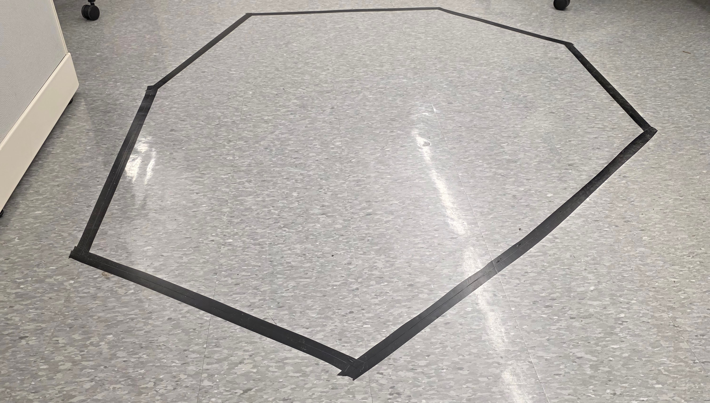
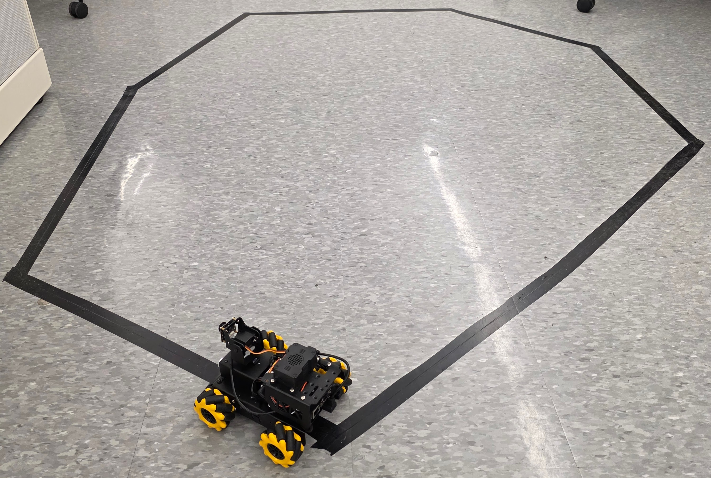
[](https://www.youtube.com/watch?v=YOUR_VIDEO_ID)
```

---

## 10. Implemented Features (What Works Now)

### 10.1 VR Teleoperation

**Script:** `VRTurboPiTeleop.cs`  
**Status:** Working

The Meta Quest left thumbstick is read via the Unity Input System `InputActionReference` and published as a `geometry_msgs/Twist` message to `/cmd_vel` at 10 Hz (configurable via `publishFrequency`).

| Joystick axis | ROS field | Effect on robot |
|---|---|---|
| Y (push forward) | `linear.x` (negated) | Forward / backward |
| X (push right) | `angular.z` (negated) | Rotate right / left |

The mecanum robot currently **only receives forward and turn** commands from VR — lateral (strafe) motion is not yet mapped from a VR input.

**Parameters** (Inspector):

| Field | Default | Description |
|---|---|---|
| `maxLinearSpeed` | 0.5 | m/s scale for linear.x |
| `maxTurnSpeed` | 3.0 | rad/s scale for angular.z |
| `publishFrequency` | 0.1 s | Publish interval |

---

### 10.2 Live Camera Feed in VR

**Script:** `VRVideoFeed.cs`  
**Status:** ✅ Working (with latency caveats — see [Section 11](#11-current-challenges-and-limitations))

Subscribes to `/image_raw/compressed` (`sensor_msgs/CompressedImage`). The JPEG payload is decoded by Unity's `Texture2D.LoadImage()` and applied to a `RawImage` UI panel visible in the VR scene.

A **double-buffer pattern** decouples network receive (ROS callback thread) from the Unity render thread:

```
ROS Callback thread          Unity main thread (Update)
──────────────────           ─────────────────────────
ReceiveImage()               if isNewFrameAvailable
  → store bytes in           && timeSinceLastFrame ≥ 1/maxFPS
    latestImageData            → LoadImage(bytes)
  → set isNewFrameAvailable      apply texture
```

The `maxFPS` cap (default: **15 fps**) prevents the VR frame rate from being destroyed by continuous JPEG decode on the main thread.

**The camera must publish a compressed topic.** The `usb_cam` node is configured to publish both `/image_raw` and `/image_raw/compressed`. No additional relay node is required.

---

### 10.3 Robot Orientation Sync (Partial)

**Script:** `TwinOrientation.cs`  
**Status:** Partial — orientation only, no position

Subscribes to `/odom` (`nav_msgs/Odometry`) and extracts `pose.pose.orientation`. The quaternion is converted from ROS to Unity coordinates and applied directly to the 3D robot model's `Transform.rotation`.

The `/odom` source is **`temp_odom`** — a dead-reckoning node in the `bringup` package that fuses:
- **Linear velocity** from the last `/cmd_vel` message (scales configurable)
- **Yaw rate** from `/imu/data` (BNO055 angular velocity)

Because `temp_odom` integrates yaw from IMU it provides **reasonable heading** but **no accurate position** — positional error accumulates rapidly without wheel encoders or an external reference.

---

### 10.4 Local Physics Simulation

**Script:** `MecanumTeleop.cs`  
**Status:** Working as a standalone Unity simulation — **disconnected from real robot**

Uses Unity's `ArticulationBody` components to physically simulate all four mecanum wheels. Input comes from the VR left thumbstick, keyboard (WASD), or gamepad left stick.

The mecanum kinematics mirror the ROS implementation:

```
fl = (forward + strafe − turn) × speed × −1
fr = (forward − strafe + turn) × speed × −1
bl = (forward − strafe − turn) × speed
br = (forward + strafe + turn) × speed
```

> **Important:** This simulation runs **entirely inside Unity** and sends **no ROS messages**. It serves as a visual preview but does not reflect real robot state and does not command the physical robot.

---

### 10.5 Keyboard / Gamepad Teleoperation

**Script:** `TurboPiTeleop.cs`  
**Status:** Working

Publishes `/cmd_vel` from WASD keyboard, Xbox/PlayStation gamepad, or Quest left thumbstick (fallback). Useful for PC Editor testing without a headset.

**Important sign note:** `linear.x` is **negated** from the joystick Y-axis (`cmdVel.linear.x = -joystickInput.y * maxLinearSpeed`) — pushing the thumbstick forward sends positive forward velocity to the robot (ROS convention: +X is forward).

---

## 11. Current Challenges and Limitations

### 11.1 Position Is Not Tracked

`TwinOrientation.cs` only reads the `orientation` field of `/odom` and discards `pose.pose.position`. The digital twin robot model **rotates** to match the physical robot's heading but does not **translate** across the Unity scene.

The underlying cause: `temp_odom` integrates position from `cmd_vel` linear velocity alone, with no wheel encoder correction. The resulting XY drift makes the position estimate unreliable for display after more than a few seconds of driving.

### 11.2 IMU Orientation and Magnetic Interference

The BNO055 operates in NDOF (9-axis fusion) mode by default, which uses the magnetometer for absolute heading. Under motor operation, the motors introduce significant magnetic interference that causes jumps in the fused heading output.

- **Symptom:** The 3D robot model in Unity suddenly snaps to a different orientation when the robot starts driving.
- **Root cause:** DC brushed motors generate strong magnetic fields that distort the BNO055 compass readings.
- **Workaround in place:** `temp_odom` uses IMU *yaw rate* (gyroscope) rather than the absolute magnetometer heading — this is more robust to magnetic interference but still drifts over time.
- **Proper fix (future):** Apply a hard-iron/soft-iron calibration to the magnetometer, or switch to a purely gyroscope-based heading for indoor use.
- **Axis mapping note:** The physical mounting orientation of the BNO055 on the robot has not been fully verified against the URDF `imu_link` frame definition. Small rotational offsets may exist. A static TF transform may need to be added.

---

### 11.3 Video Feed Latency and Quality

The `/image_raw/compressed` stream goes through:

```
USB Camera → usb_cam_node → ROS topic → TCP bridge → Unity → Texture2D decode
```

Round-trip network latency is typically **150–400 ms** over Wi-Fi, depending on network conditions and JPEG quality settings. The 15 fps cap in `VRVideoFeed.cs` reduces GPU load but increases perceived latency in the VR view.

There is no timestamp synchronisation between the video frame and the robot's current pose — the displayed frame may be 200–500 ms older than the robot's actual position shown in the 3D model.

### 11.4 ROS-TCP-Endpoint Not in Default Bringup

The TCP bridge launch file is **commented out** in `bringup.launch.py`:

```python
# web_video_server_launch,
# rosbridge_websocket_launch,
# sonar_controller_launch,
# start_app_launch,
```

The endpoint must be started manually in a separate terminal. This means after any reboot or automatic startup via `start_app_node.service`, Unity cannot connect until the endpoint is launched by hand.

### 11.5 No Joint State Synchronisation

The TurboPi URDF has revolute joints for:
- 4× wheel hubs (continuous rotation)
- Pan-tilt camera (joint1/joint2 — revolute, ±90°)

None of these are published as `sensor_msgs/JointState` from the robot side, and Unity does not subscribe to any joint state topic. The URDF model in Unity has **static joint poses** — wheels do not spin and the camera does not pan/tilt in sync with the physical robot.

### 11.6 No Sonar or Sensor Data in Unity

The `sonar_controller_node` is also commented out of the default bringup. Even when running, no Unity script subscribes to `sonar_controller/get_distance`. There is no visual indicator of obstacle proximity in the VR scene.

### 11.7 MecanumTeleop Is a Standalone Simulation

`MecanumTeleop.cs` is a self-contained local physics simulation. It receives no data from the robot and sends no data to it. Running this script while also running `TurboPiTeleop.cs` or `VRTurboPiTeleop.cs` will result in **two independent movement systems** acting on different objects (or the same object), causing visual desynchronisation.

### 11.8 Odometry Is Dead-Reckoning Only

`temp_odom` is explicitly named "temporary" — it uses IMU yaw rate for heading and `cmd_vel` for linear velocity to dead-reckon position. There are no wheel encoders on the TurboPi (the STM32 reports no encoder counts in the current SDK), so positional drift is uncorrected.

For any future heading/position fidelity, an external localisation source (AprilTags, optical flow, visual-inertial odometry) is required.

### 11.9 No AI Agent State Reflected in Twin

All `large_models` nodes (voice, ASR, LLM agents, VLLM) run on the robot and publish results to ROS topics. None of these topics are bridged to Unity. An observer in VR cannot see:
- What voice command was received
- What LLM action was selected
- What colour/object the robot is currently tracking

### 11.10 Line Follower Limitations

The line-following CV node uses three horizontal ROIs in LAB colour space. Known issues:
- Sensitive to ambient lighting — the LAB colour calibration YAML must be re-done under different lighting conditions
- Loses the line at sharp corners where the line exits all three ROIs simultaneously
- PID gains are hard-coded and may need retuning if robot speed or camera angle changes


### 11.11 Latency of VR Thumbstick → Robot Motion

The publish interval for teleop scripts is 100 ms (10 Hz). At 10 Hz with Wi-Fi round-trip overhead, effective control latency to the physical robot is **100–400 ms**, which can feel sluggish for reactive driving in VR.

---

## 12. Architecture of the Full Vision

The intended full digital twin provides **bidirectional real-time state sync** across five data channels:

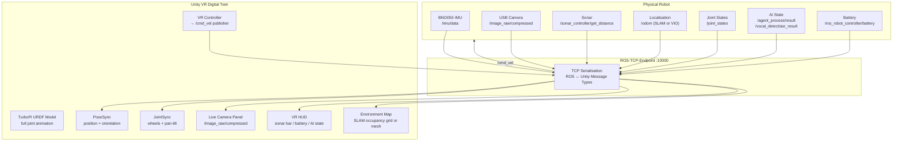

---

## 13. Future Implementations and Future Robots

### 13.1 Full Pose Synchronisation (Position + Orientation)

**What is needed:**
- A reliable `/odom` source with sub-10 cm position accuracy.
- `TwinOrientation.cs` extended to also apply `pose.pose.position` to `robotModel.position` (with the same ROS→Unity axis remap).

**Approach options:**

| Option | Pros | Cons |
|---|---|---|
| **AprilTag visual localisation** | No extra hardware; camera already present | Tag placement required; occlusion breaks localisation |
| **Visual-Inertial Odometry (VIO)** e.g. ORB-SLAM3 | No markers; works in textured environments | Computationally heavy for Raspberry Pi |
| **Optical flow sensor** | Cheap, low latency | Only 2D, no height info |
| **External overhead camera** | High accuracy; simple | Extra infrastructure |

Once `/odom` position is reliable, add to `TwinOrientation.cs`:

```csharp
// ROS position → Unity position (swap axes)
robotModel.position = new Vector3(
    (float)-msg.pose.pose.position.y,
    0f,                                       // keep Y flat (ground plane)
    (float) msg.pose.pose.position.x
);
```

---

### 13.2 Joint State Synchronisation (Wheels + Pan-Tilt)

**What is needed on ROS side:**
- Publish `sensor_msgs/JointState` from `ros_robot_controller_node` containing:
  - 4× wheel positions (integrated from motor speed commands, estimated)
  - PWM servo angles from `/ros_robot_controller/pwm_servo/get_state`

**What is needed on Unity side:**
- A `JointStateSubscriber.cs` script that maps incoming `JointState` joint names to Unity `ArticulationBody` or `Transform` targets.
- The URDF import already defines named joints (`joint1`, `joint2`, `wheel_front_left_joint`, etc.).

This would make wheels visibly spinning and the camera panning/tilting in sync with the physical robot, dramatically increasing twin fidelity.

---

### 13.3 Sonar Obstacle Visualisation

**What is needed:**
- Start `sonar_controller_node` in the default `bringup.launch.py`.
- Add ROS-TCP-Endpoint to the default bringup.
- Write `SonarOverlay.cs` in Unity that subscribes to `sonar_controller/get_distance` and renders a coloured arc or distance bar in the VR HUD.

A simple implementation:

```csharp
void OnSonarReceived(Int32Msg msg)
{
    float distanceMetres = msg.data / 1000f;
    // Scale a warning arc or bar from green (>50 cm) to red (<20 cm)
    sonarIndicator.color = Color.Lerp(Color.red, Color.green,
        Mathf.InverseLerp(0.0f, 0.5f, distanceMetres));
    sonarText.text = $"{distanceMetres:F2} m";
}
```

---

### 13.4 AI Agent State HUD

**What is needed:**
- Subscribe to `vocal_detect/asr_result` (String) — display live speech transcript.
- Subscribe to `agent_process/result` (String) — display JSON action chosen by LLM.
- Subscribe to `tts_node/play_finish` (Bool) — animate a "speaking" indicator.

A floating VR panel showing:
- Current voice command heard
- LLM action sequence being executed
- Active app mode (line following / colour tracking / etc.)

---

### 13.5 SLAM Map Visualisation

**Stretch goal.** Run a SLAM package (e.g. `slam_toolbox` or `cartographer`) on the robot. Publish the occupancy grid to `/map` (`nav_msgs/OccupancyGrid`).

On the Unity side, subscribe to `/map` and reconstruct the grid as a Unity mesh or render texture overlaid on the scene floor.

This would allow the VR observer to see the track map being built in real time as the robot drives.

---

### 13.6 Integrate ROS-TCP-Endpoint Into Default Bringup

The endpoint must be always-on for the digital twin to function automatically. Add the following to `bringup.launch.py`:

```python
ros_tcp_endpoint_launch = IncludeLaunchDescription(
    PythonLaunchDescriptionSource(
        os.path.join(
            get_package_share_directory('ros_tcp_endpoint'),
            'launch/endpoint.py'
        )
    )
)
```

And add `ros_tcp_endpoint_launch` to the return list.

---

### 13.7 Lateral Strafe for VR Teleop

The TurboPi is a **mecanum** robot — it can strafe sideways. The current VR teleop only maps forward and turn. Add the **right thumbstick X-axis** to `linear.y` in `VRTurboPiTeleop.cs`:

```csharp
// Right thumbstick for strafe
Vector2 rightStick = rightThumbstick.action.ReadValue<Vector2>();
cmdVel.linear.y = rightStick.x * maxLinearSpeed;
```

---

### 13.8 Compressed Image Quality Tuning

The `usb_cam` node defaults may produce large JPEG payloads. Add explicit quality and resolution parameters to `usb_cam.launch.py`:

```python
parameters=[{
    'image_width': 320,
    'image_height': 240,
    'framerate': 15.0,
    'compression_quality': 30,   # 0-100; lower = smaller, more latency-friendly
}]
```

This reduces per-frame payload and improves VR streaming smoothness.

---

### 13.9 Haptic Feedback on Collision

When sonar distance drops below the avoidance threshold, trigger a haptic pulse on the VR controller:

```csharp
UnityEngine.XR.InputDevices.GetDeviceAtXRNode(XRNode.LeftHand)
    .SendHapticImpulse(0, 0.5f, 0.1f);
```

---

### 13.10 Battery Level HUD

Subscribe to `/ros_robot_controller/battery` (`std_msgs/UInt16`, mV) and display a battery icon in the VR HUD. Trigger a warning at ~7200 mV (2S LiPo low threshold).

---

### 13.11 Future Robots — Expanding the Platform

The TwinSight digital twin framework is designed to be robot-agnostic. The key adaption points are the URDF model, the topic names, and the Unity C# scripts. Below are planned expansions.

#### Dr Gilbert's Robot

> **TO DO LATER** — Document integration with Dr Gilbert’s robot platform. Specify:
> - Hardware specs and what ROS packages it runs
> - What URDF/mesh files are needed
> - Which ROS topics map to the existing Unity scripts
> - Any new Unity scripts that would be required
> - Whether a new Docker/ROS environment is needed
>
> Photo of the robot to add once available:
> ```markdown
> 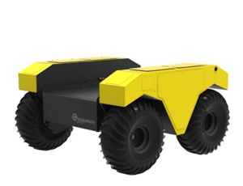
> ```

#### Dedicated Line-Following Robot

> **TO DO LATER** — A simpler line-following robot may serve as a more controlled testbed for validating position sync and joint sync before implementing them on the full TurboPi. Document:
> - Hardware specs
> - Minimal ROS packages needed
> - Unity changes required (new URDF import, updated topic names)
>
> Photo to add:
> ```markdown
> 
> ```

#### Multi-Robot Support

> **TO DO LATER** — Running multiple robots simultaneously in the same digital twin environment. Each robot would use a unique ROS namespace or `ROS_DOMAIN_ID`. The Unity scene would show all twins simultaneously. Document the namespace strategy and Unity scene architecture required.
>
> Diagram/screenshot to add:
> ```markdown
> 
> ```

---

## 14. Achievements

This section records significant milestones reached during the project, including problems discovered in the process.

> Photos and videos for each achievement are embedded in their respective subsections below.
> Save all images to `documentation/images/` and use `` to embed them.

---

### 14.1 VR Application Running on Meta Quest 3

**Achievement:** Successfully built and deployed a Unity VR application to the Meta Quest 3 that connects to a running ROS 2 system over Wi-Fi and drives a real robot.

**What was accomplished:**
- ROS-TCP-Connector package integrated into the Unity project
- ROS-TCP-Endpoint node confirmed running on the robot's Raspberry Pi
- `SimplePublisher.cs` and `SimpleSubscriber.cs` confirmed bidirectional message flow
- Unity build deployed to Quest 3 via Meta Quest Developer Hub (sideloaded APK)
- VR thumbstick commands (`VRTurboPiTeleop.cs`) confirmed to drive the physical TurboPi robot

**Key challenge solved:** Initial joystick-to-robot mapping had the robot driving backwards and turning in the wrong direction. Fixed by negating both `linear.x` and `angular.z` in the teleop scripts after physical hardware testing.

> **TO DO LATER** — Add photo/video of the Quest 3 running with the robot responding.
>
> ```markdown
> 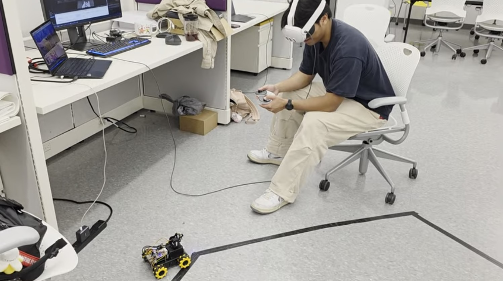
> [](https://www.youtube.com/watch?v=YOUR_VIDEO_ID)
> ```

---

### 14.2 Live Camera Feed in VR

**Achievement:** Real-time (15 fps) camera feed from the TurboPi USB camera displayed on a panel inside the VR environment.

**What was accomplished:**
- Confirmed `usb_cam` node publishes `/image_raw/compressed`
- `VRVideoFeed.cs` successfully receives JPEG data over the TCP bridge and renders it in VR
- Double-buffer threading pattern implemented to prevent VR frame drops during JPEG decode
- 15 fps frame-rate cap found to be necessary — without it, continuous JPEG decoding on the Unity main thread dropped VR rendering below 30 fps

> **TO DO LATER** — Add screenshot of the VR panel showing the live robot camera feed.
>
> ```markdown
> 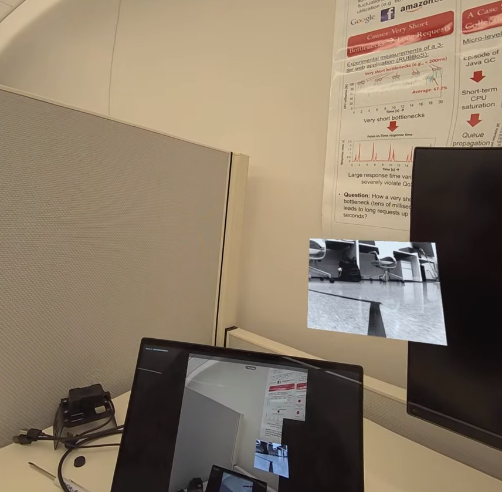
> ```

---

### 14.3 Robot Orientation Sync (IMU → Unity)

**Achievement:** The 3D model of the TurboPi in Unity rotates in real time to match the physical robot's heading, driven by BNO055 IMU data.

**What was accomplished:**
- `imu_pi` package (`bno055_publisher` node) confirmed reading real IMU data over I²C
- `temp_odom` node fusing IMU yaw rate with `cmd_vel` to produce `/odom`
- `TwinOrientation.cs` subscribing to `/odom` and applying coordinate-converted quaternion to the model
- ROS Z-up to Unity Y-up quaternion conversion formula (`Unity(x,y,z,w) = ROS(-y,z,-x,w)`) derived and verified through testing

> **TO DO LATER** — Add video showing robot and Unity model rotating in sync.
>
> ```markdown
> [](https://www.youtube.com/watch?v=YOUR_VIDEO_ID)
> ```

---

### 14.4 Hardware Faults Discovered

During development, the following faults or unexpected behaviours were identified:

#### Fault 1 — Motor Direction Sign Inconsistency
The mecanum kinematics in `mecanum.py` applies negation to motors 1 and 3 (`[-motor1, motor3, -motor2, motor4]`). This is not documented in the manufacturer's SDK and was discovered by observing the robot moving in unexpected directions under certain velocity commands. The sign corrections represent a physical wiring correction for those specific motors.

#### Fault 2 — Line Follower Sensor Inconsistensy
The Sensor for the line follower, located at the bottom of the TurboPi robot and is duct taped onto the robot, if was put in the correct spot, would no work due to how it works. It uses infrared lights and trackers to track a black line on the floor, there is too much reflect on the floor for it to work properly in the correction positioning hence the duct tape.

#### Fault 3 — Power usage when plugged into Wall
The power usage, if plugged into the wall, is not strong enough to power the raspberrypi and the motors attached to the robot. HIGHLY recommend getting a new power supply for the raspberrypi.

> **TO DO LATER** — Add photos documenting each fault and the testing that identified it.
>
> ```markdown
> 
> 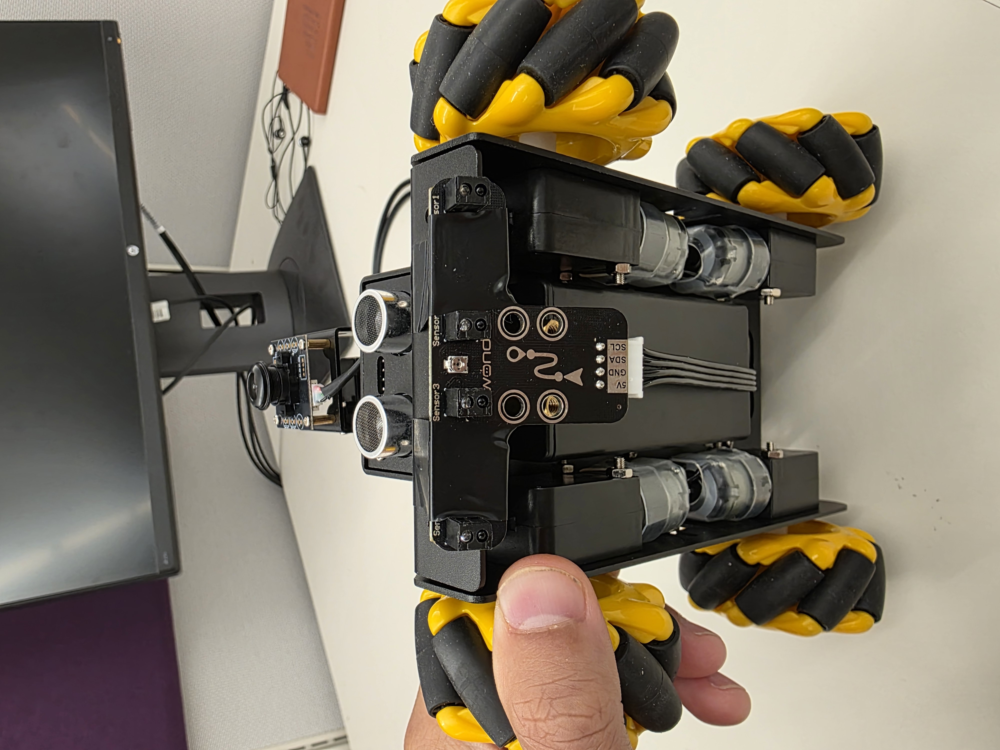
> 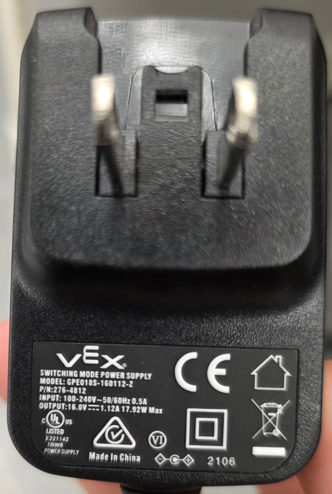
> ```

---

## 15. Data Flow Reference

### Current Active Data Flows

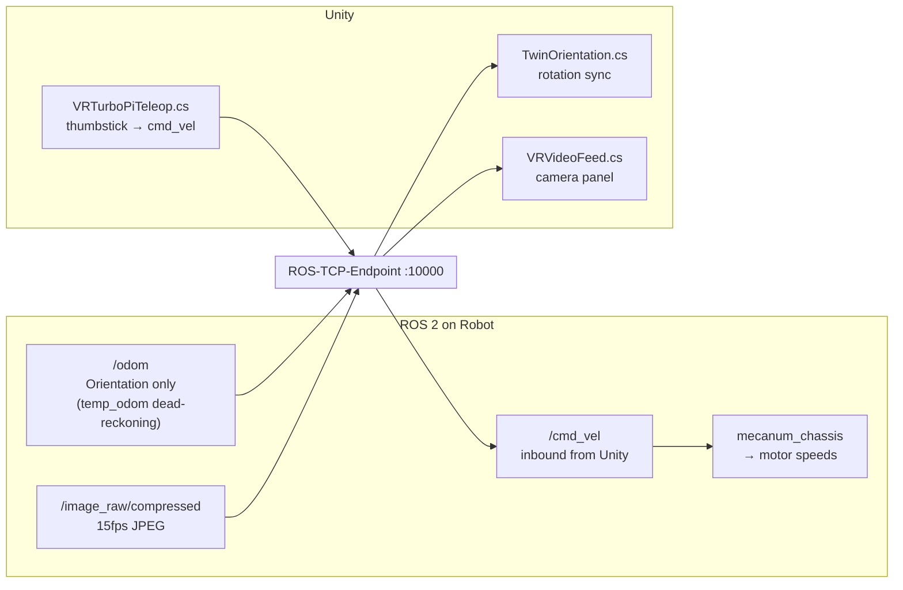

### Planned Full Data Flows

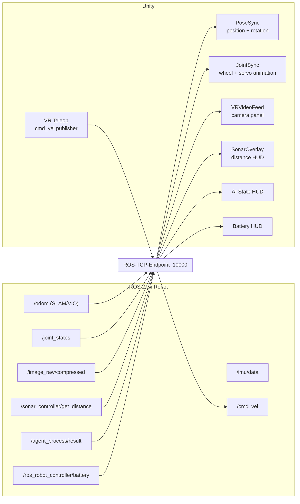

---

## 16. Developer Notes

### Running the Digital Twin End-to-End

**On the Robot (Docker container):**

```bash
# 1. Full robot bringup
ros2 launch bringup bringup.launch.py

# 2. TCP bridge (separate terminal, until integrated into bringup)
ros2 run ros_tcp_endpoint default_server_endpoint --ros-args -p ROS_IP:=192.168.149.1
```

**In Unity:**

1. Open the `HighFaceCount` scene.
2. In the `ROSConnection` GameObject, set **ROS IP** to the Pi's LAN address, **port** 10000.
3. Ensure `TwinOrientation.cs` has `robotModel` assigned to the imported URDF root.
4. Ensure `VRVideoFeed.cs` has `displayScreen` assigned to the `RawImage` panel.
5. Press **Play** (Editor) or build to Meta Quest.

### File Locations

| File | Purpose |
|---|---|
| `Assets/ROS/Sensors/TwinOrientation.cs` | Orientation sync from `/odom` |
| `Assets/ROS/Test_script/VRTurboPiTeleop.cs` | VR controller → `/cmd_vel` |
| `Assets/ROS/Test_script/TurboPiTeleop.cs` | Keyboard / gamepad → `/cmd_vel` |
| `Assets/ROS/Test_script/VRVideoFeed.cs` | Camera feed → VR panel |
| `Assets/ROS/Test_script/MecanumTeleop.cs` | Local Unity physics sim |
| `Assets/ROS/Test_script/TwinSightTeleop.cs` | Test: `/cmd_vel` → Unity cube |
| `Assets/ROS/Turbopi_CAD/urdf/turbopi_compiled.urdf` | URDF robot model in Unity |
| `ros2_ws/src/ROS-TCP-Endpoint/` | ROS 2 TCP bridge package |
| `ros2_ws/src/bringup/bringup/temp_odom.py` | Dead-reckoning odometry node |
| `ros2_ws/src/imu_pi/imu_pi/publish_imu_ros2.py` | BNO055 IMU publisher |
| `ros2_ws/src/simulations/turbopi_description/urdf/turbopi.xacro` | Source URDF/Xacro |
| `docker/docker-compose.yml` | Dev environment definition (docker folder deleted — recreate when needed) |

### Known Gotchas

| Issue | Cause | Fix |
|---|---|---|
| Unity cannot connect | TCP endpoint not running | `ros2 launch ros_tcp_endpoint endpoint.py` |
| Robot drives backward when pushing forward in VR | Sign convention | `linear.x = -joystickInput.y` — already applied |
| Robot turns opposite direction | Coordinate handedness | `angular.z = -joystickInput.x` — already applied |
| Model does not rotate in scene | `robotModel` field not assigned in Inspector | Drag URDF root to the field |
| Video feed frozen | `/image_raw/compressed` not published | Check `usb_cam` node is running |
| High VR latency on video | Wi-Fi or large JPEG payload | Reduce resolution/quality in `usb_cam` params |
| `ASR_LANGUAGE` not set | config.py import fails | `export ASR_LANGUAGE=English` before launch |

---

*Documentation written from source code analysis — May 2026.*
